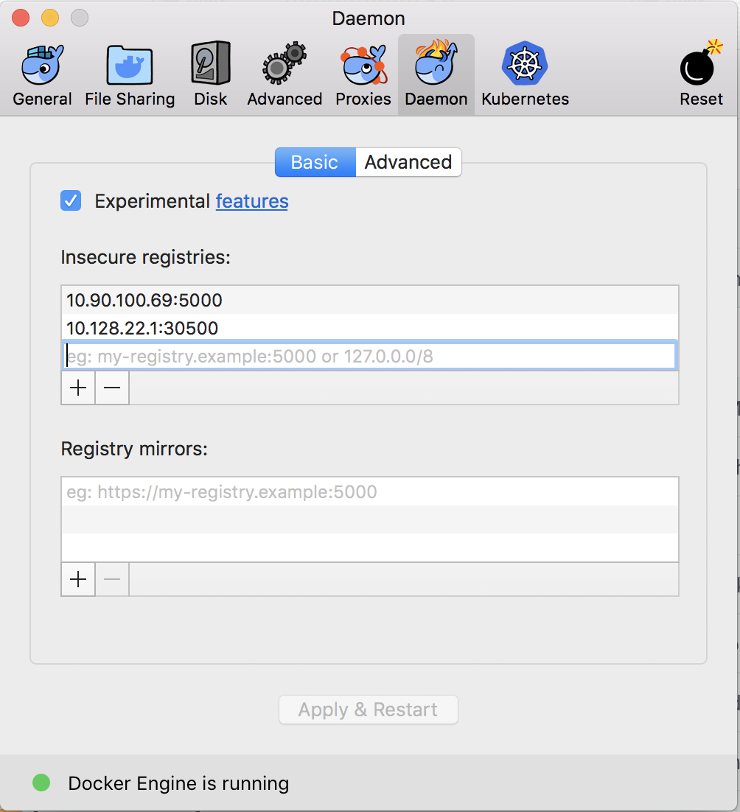
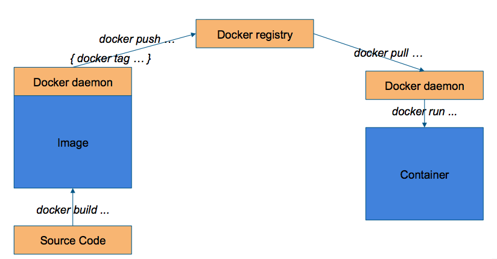

# SEBA in a Box for development

This tutorial will guide you through the development workflow for a SEBA component using
the environment provided by SEBA in a Box.

The tutorial will use the `rcord` service as an example, but the same workflow can be used
for each docker-based component in SEBA. 

If you are working on ONOS applications, you want to take a look at this [tutorial](./onos-apps.md).

> NOTE that the same workflow can be adapted for:
> - different emulated environment (eg: `MCORD in a Box`)
> - physical setups

### Requirements

In order to follow this tutorial you need to:

- have a remote machine to run [SEBA-in-a-Box](../../profiles/seba/siab.md)
- have Docker installed on your development machine (Install docker on [Mac](https://docs.docker.com/docker-for-mac/install/), [Ubuntu](https://docs.docker.com/install/linux/docker-ce/ubuntu/) or [Windows](https://docs.docker.com/docker-for-windows/install/))
- have the CORD code (we suggest to download the code using [this guide](../getting_the_code.md#download-cord-repositories)) 



## Deploy a docker registry

In order to move Docker images from your laptop to the SEBA in a Box environment you need
a Docker registry. You can install one using `helm`:

```bash
helm install stable/docker-registry --set service.nodePort=30500,service.type=NodePort -n docker-registry
```

### Configure docker to push to an insecure registry

The registry deployed via `helm` is by default an insecure registry (it uses `http` instead of `https`)
thus `docker` requires that you explicitly authorize that registry.

You can find more informations about insecure registries on the [docker documentation](https://docs.docker.com/registry/insecure/).

#### MacOS

To open the `Docker` preferences click on the icon in the status bar (top right of the screen)
and select `preferences`.

Navigate to the `Daemon` tab and under `Insecure registries` add the `ip` and `port` of the one
running on your `SiaB` machine:



> NOTE that the docker-registry endpoint should be `myregistrydomain.com:30500`
> where `myregistrydomain.com` is the public `ip` of your `SiaB` machine.

Click on `Apply and Restart` to apply your changes.

#### Linux

> This needs to be done on the SiaB machine (and on you machine if it's a Linux based machine)

Edit the `/etc/docker/daemon.json` file and add:

```json
{
  "insecure-registries" : ["myregistrydomain.com:30500"]
}
```

where `myregistrydomain.com` is the public `ip` of your `SiaB` machine.

Then restart the docker daemon with: `sudo service docker restart`

## Make changes and publish the image

Once you make the appropriate changes to the code, you can buid it with:

```bash
cd ~/cord/orchestration/xos-services/rcord
DOCKER_REGISTRY=myregistrydomain.com:30500/ DOCKER_REPOSITORY=xosproject/ DOCKER_TAG=candidate make docker-build
...
Successfully built 14a4ec8f2906
Successfully tagged myregistrydomain.com/xosproject/rcord-synchronizer:candidate
```
where `myregistrydomain.com` is the public `ip` of your `SiaB` machine.

> **Note:** In some cases the command to build the docker image may vary. 
> Please check the Makefile within the repo for more informations.

To push the newly built image to your docker registry use this command:

```bash
cd ~/cord/orchestration/xos-services/rcord
DOCKER_REGISTRY=myregistrydomain.com:30500/ DOCKER_REPOSITORY=xosproject/ DOCKER_TAG=candidate make docker-push
docker push myregistrydomain.com:30500/xosproject/rcord-synchronizer:candidate
The push refers to repository [myregistrydomain.com:30500/xosproject/rcord-synchronizer]
43b4d40e8ced: Layer already exists
70019539cd35: Layer already exists
56585fbf0fe2: Layer already exists
4929606216d8: Layer already exists
343eab13e1e3: Layer already exists
ea7c8d4e60dc: Layer already exists
7d63eb9a32c4: Layer already exists
bcf2f368fe23: Layer already exists
candidate: digest: sha256:f5ecac2ba76c2a81a6f8b82b09e07c53f9ca2f3d272c8861ed7f5ed1ac290ac8 size: 1993
```

where `myregistrydomain.com` is the public `ip` of your `SiaB` machine.

## Customizing the installation

When `SiaB` is installed with the `make latest` command, a [`values.yaml`](https://github.com/opencord/helm-charts/blob/master/configs/seba-ponsim-latest.yaml) file is applied
to all the `helm install` commands.

> To know more about `values` files, please check the official [helm documentation](https://helm.sh/docs/chart_template_guide/#values-files)

To customize the installation, download the default `seba-ponsim-latest.yaml` so that you can customize it:

```bash
curl https://raw.githubusercontent.com/opencord/helm-charts/master/configs/seba-ponsim-latest.yaml -o ~/custom.yaml
```

### Update the helm chart

To deploy the new container you need to update the helm-chart, but first you need to customize the
value file.

Open the file you downloaded in `~/custom.yaml` and change the `rcord` section so that it looks like:

```yaml
rcord:
  image:
    repository: "myregistrydomain.com:30500/xosproject/rcord-synchronizer"
    tag: 'candidate'
```

The `rcord` service is installed by the `seba-services` helm chart, so you need to upgrade it to
the new version:

```bash
cd ~/cord/helm-charts
helm upgrade --install seba-services xos-profiles/seba-services -f ~/custom.yaml
```

> NOTE it's important that you upgrade the chart defining the component you are developing.
> For more informations about the helm charts visit the [Helm reference](../../charts/helm.md) section in the guide.

### Reinstall from scratch

In some cases you want to restart from a clean environment using your images.
If you do that it is important not to run the `make reset-kubeadm` command as that will
completely teardown kubernetes, deleting the docker registry.

To remove all the installed containers you can instead use the `make teardown-charts` commands.

Once all the containers have been removed, you can reinstall everything using your value file with:

```bash
SEBAVALUES=~/custom.yaml make
```

> NOTE that the `latest` target is not needed as we are specifying a custom value file through the `SEBAVALUES` variable.

## Troubleshooting

If you are facing issues with this development workflow, please report your problem on the [SEBA-dev](https://groups.google.com/a/opennetworking.org/forum/#!forum/seba-dev)
or [CORD-dev](https://groups.google.com/a/opencord.org/forum/#!forum/cord-dev) mailing lists, or contact `@teone` on slack.

## FAQs

### I want to update an image that comes from a different chart, how do I know the value file structure?

If you're not familiar with how value files work we suggest to read the [official documentation](https://helm.sh/docs/chart_template_guide/#values-files)
but to make it short you can look for the `values.yaml` file in the helm chart you are working with.

> If the helm chart is installed as a requirement of another chart also look for the requirement name
> in the parent chart. For example the `rcord` chart is installed as part of [`seba-services`](https://github.com/opencord/helm-charts/blob/master/xos-profiles/seba-services/requirements.yaml#L17-L19)
> and that's why we nest the customization under `rcord`.

### Why do I need a remote docker-registry?

We have a talk about this topic during ONF Connect 2018, you can find the recording [here](https://vimeo.com/307548812/cf9c31e226)
and the slides [here](https://www.opennetworking.org/wp-content/uploads/2018/12/How-the-New-Platform-Will-Make-Your-Life-Better.pdf).

To explain that in few words, you need a way to move the docker image from the "build" machine to the "host" machine,
as described in the picture below.



#### I don't want to use a private docker-registry, can I use Docker Hub?

If you don't want to deploy a docker-registry on the POD, you can use any docker registry.
The `docker-build/docker-push` commands are flexible enough to accomodate that,
for example you can build and push the container with these commands:

```bash
DOCKER_REPOSITORY=matteoscandolo/ DOCKER_TAG=candidate make docker-build
DOCKER_REPOSITORY=matteoscandolo/ DOCKER_TAG=candidate make docker-push
```

And customize your value file to fetch that image:

```yaml
rcord:
  image:
    repository: "matteoscandolo/rcord-synchronizer"
    tag: 'candidate'
```

#### Can I build images on the SiaB machine and use those?

Yes, you can build the docker containers directly on the SiaB host machine, just be aware that this workflow won't
transfer to a multi-node cluster.

If you build the `rcord-synchronizer` docker image on the SiaB machine with:

```bash
DOCKER_REPOSITORY=xosproject/ DOCKER_TAG=candidate make docker-build
```
 
you can change the `custom.yaml` value file in this way to use it:

```yaml
rcord:
  image:
    tag: 'candidate'
    pullPolicy: 'IfNotPresent'
``` 

> For more information about this workflow we suggest to take a look at the talk mentioned in the [Why do I need a remote docker-registry?](./siab.md#why-do-i-need-a-remote-docker-registry) section. 

### Can use the same workflow to test VOLTHA images?

Yes, the workflow to test VOLTHA images is absolutely the same, but some of the commands are different.

On your local machine you can build VOLTHA images with:

```bash
cd ~/cord/incubator/voltha
REPOSITORY=voltha/ TAG=candidate VOLTHA_BUILD=docker make build
```

Then you need to tag and push the images you want to upload with:

```bash
docker tag voltha/voltha-voltha:candidate myregistrydomain.com:30500/voltha/voltha-voltha:candidate
docker push myregistrydomain.com:30500/voltha/voltha-voltha:candidate
```

where `myregistrydomain.com` is the public `ip` of your `SiaB` machine.

And update you `custom.yaml` value file on the SiaB machine with:

```yaml
images:
  vcore:
    repository: "myregistrydomain.com:30500/voltha/voltha-voltha"
    tag: 'candidate'
```