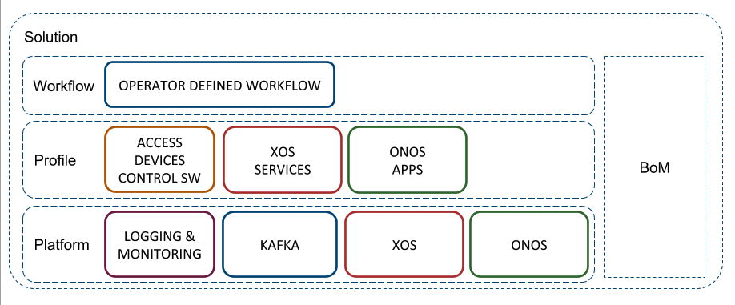

# Navigating CORD

## Assembled from Components

A given instance of CORD is assembled from a set of disaggregated
components. This assembly is done according to the general pattern
shown in the following diagram.

There are four major elements:

* **Kubernetes:** All elements of the CORD control plane run in
  Kubernetes containers. CORD assumes a Kubernetes foundation (not shown above),
  but does not prescribe how Kubernetes or the underlying hardware
  are installed.

* **Platform:** The Platform layer consists of ONOS, XOS,
  Kafka, and collection of Logging and Monitoring micro-services,
  all running on a Kubernetes foundation. The platform is common
  to all Profiles.

* **Profile:** Each unique CORD configuration is defined by a
  Profile. It consists of a set of services (e.g., access services,
  VNFs, other cloud services), including both abstract services
  on-boarded into XOS and SDN control apps running on ONOS.
  Examples of profiles are [SEBA](profiles/seba) and
  [M-CORD](profiles/mcord).

* **Workflow:** A Profile typically includes a workflow,
  which defines the business logic and state machine for one of the
  access technologies contained in the Profile. A workflow customizes
  a Profile for an operator's target deployment environment; it is not a
  software layer, per se.  SEBA's
  [AT&T Workflow](profiles/seba/workflows/att-install.md)
  is an example.

The diagram also shows a hardware bill-of-materials, which must be
defined for a given POD.

## Operationalized in Stages

Understanding the relationship between installing, operating, and developing
CORD—and the corresponding toolsets and specification files used by
each stage—is helpful in navigating CORD.

* **Installation (Helm):** Installing CORD means installing a collection
  of Docker containers in a Kubernetes cluster. We use Helm to carry out
  the installation, with the valid configurations defined by a set of
  `helm-charts`. These charts specify the version of each container to be
  deployed, and so they also play a role in upgrading a running system.
  More information about `helm-charts` can be found [here](charts/helm.md).

* **Operations (TOSCA):** A running CORD POD supports multiple Northbound
  Interfaces (e.g., a GUI and REST API).  We typically use `TOSCA` to specify
  a recipe for configuring and provisioning a running system. A freshly
  installed CORD POD has a set of control plane and platform level containers
  running (e.g., XOS, ONOS, OpenStack), but until provisioned using `TOSCA`,
  there are no services and no service graph. More information about `TOSCA`
  can be found [here](xos-tosca/README.md).

* **Development (XOS):** The services running in an operational system
  are typically deployed as Docker containers, paired with a model that
  specifies how the service is to be on-boarded into CORD. This model is
  writen in the `xproto` modeling language, and processed by the XOS
  tool-chain. Among other things, this tool-chain generates the
  TOSCA-engine that is used to process the configuration and provisioning
  recipes used to operate CORD. More information about `xproto` (and
  other details about on-boarding a service) can be found in a companion
  [XOS Guide](https://guide.xosproject.org).

These tools and containers are inter-related as follows:

* Installing the platform brings up a set of XOS-related containers (e.g., `xos-core`,
  `xos-gui`, `xos-tosca`) that have been configured with a base set of models.
  Of these, the `xos-tosca` container implements the TOSCA engine, which
  takes TOSCA workflows as input and configures/provisions CORD accordingly.

* While the install and operate stages are distinct, for convenience,
  some helm-charts elect to launch a `tosca-loader` container
  (in Kubernetes parlance, it's a *job* and not a *service*) to load an initial
  TOSCA recipe into a newly deployed set of services. This is how a
  service graph is typically instantiated.

* While the CORD control plane is deployed as a set of Docker
  containers, not all of the services themselves run in containers.
  Some services run in VMs managed by OpenStack (this is currently
  the case for M-CORD) and some services are implemented as ONOS
  applications that have been packaged using Maven. In such cases,
  the VM image and the Maven package are still specified in TOSCA.

* Every service (whether implemented in Docker, OpenStack, or ONOS)
  has a counter-part *synchronizer* container running as part of the CORD
  control plane (e.g., `volt-synchronizer` for the vOLT service). Typically,
  the helm-chart for a service launches this synchronizer container, whereas
  the TOSCA recipe creates, provisions, and initializes the backend container,
  VM, or ONOS app.

* Bringing up additional services in a running POD involves executing
  helm-charts to install the new service's synchronizer container, which
  in turn loads the corresponding new models into XOS. This load then
  triggers and upgrade and restart of the TOSCA engine (and other NBIs),
  which is a pre-requisite for configuring and provisioning that new service.

* Upgrading an existing service is similar to bringing up a new service,
  where we depend on Kubernetes to incrementally roll out the containers
  that implement the service (and rollback if necessarily), and we depend
  on XOS to migrate from the old model to the new model (and support
  both old and new APIs during the transition period). Upgrading existing
  services has not been thoroughly tested.
