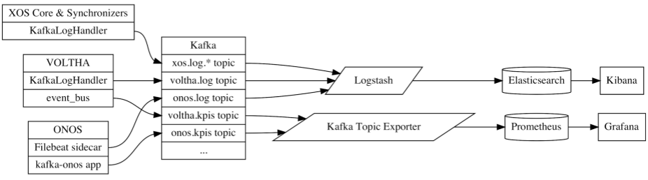

# Monitoring and Logging

CORD is usually configured with monitoring and logging capabilities,
built around Prometheus and ELK Stack, respectively. Both consume
events/metrics/logs posted to Kafka. The data they collect can be
viewed on their respective dashboards:

* **Metrics:** Collected by [Prometheus](https://prometheus.io/)
  and viewable using [Grafana](http://docs.grafana.org/) at port 31300.

* **Logs:** Collected by [Elk Stack](https://www.elastic.co/elk-stack)
  and viewable using
  [Kibana](https://www.elastic.co/guide/en/kibana/current/index.html)
  at port 30601.

The following figure give a high-level overview of the monitoring and
logging system.

The monitoring and logging pipelines both share a Kafka bus, with
event topics assigned accordingly (e.g., `component.kpis.*` and
`component.log.*`). Components also post other events to Kafka,
but their topics are currently ad hoc and rapidly evolving.
Rationalizing the event schema is on the near-term roadmap.
