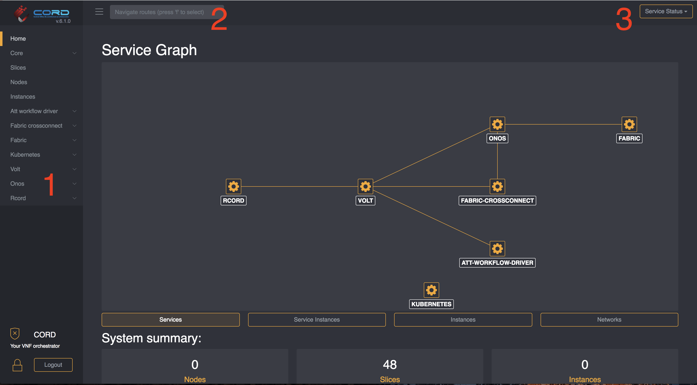

# GUI

The GUI is useful for development and demos. At the moment it is not
designed to support the scale of data one might expect in a production
deployment.

## How to Acces the GUI

Once you have CORD up and running, you can find the port on which the
GUI is available by running:

```shell
kubectl get service xos-gui


NAME      TYPE       CLUSTER-IP       EXTERNAL-IP   PORT(S)          AGE
xos-gui   NodePort   10.102.239.199   <none>        4000:30001/TCP   2h
```

By default, the GUI can be accessed on port `30001`

To connect to the GUI you can just open a browser at `<cluster-ip>:<gui-port`,
where `cluster-ip` is the ip of any node in your kubernetes cluster.

The *username* and *password* for the GUI are defined in
the [`xos-core`](../charts/xos-core.md) helm chart.

If you haven't customized the `xos-core` chart installation, then you'll be able
to login using the default username/password values: `admin@opencord.org/letmein`.

## Opening the GUI in minikube

The above works the same way when running on `minikube`, but
this helper is also available:

```shell
minikube service xos-gui
```

This command opens the GUI in your default browser.

## Using the GUI

The GUI lets you explore the data model and gives immediate feedback on the state
of the system through real time notifications.

Some basic features:

1. **Navigation**: Each item represent a service, click on it to see a list of models in that service
2. **Search Box**: Full text search in the data model. Can't find something? Here's a good place to start from
3. **Service Status**: Reports the status of each service and it's current version.


