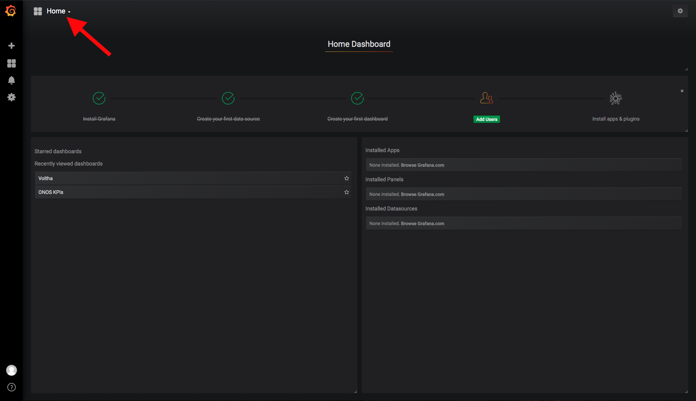
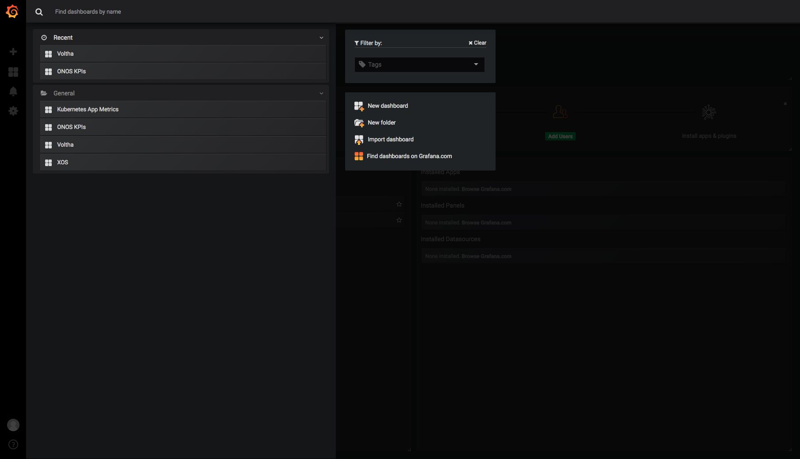
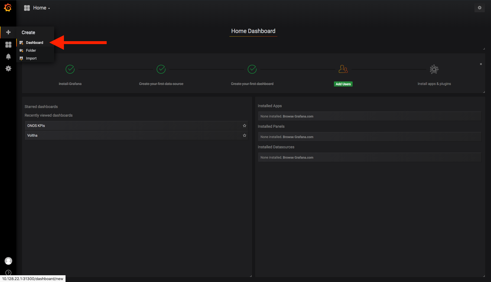
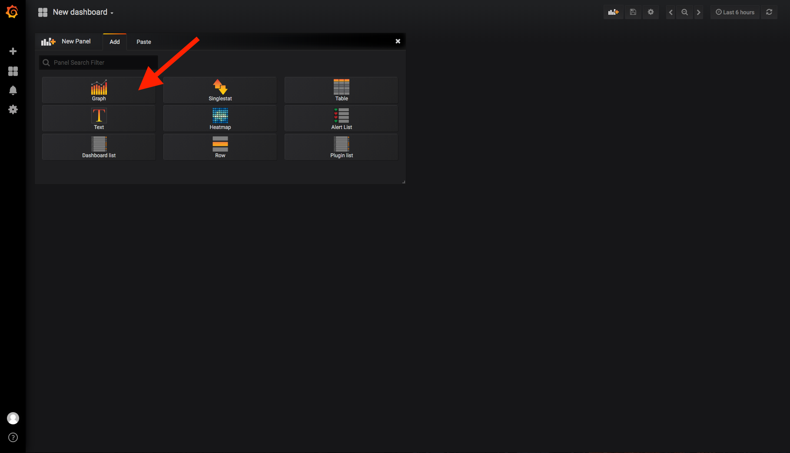
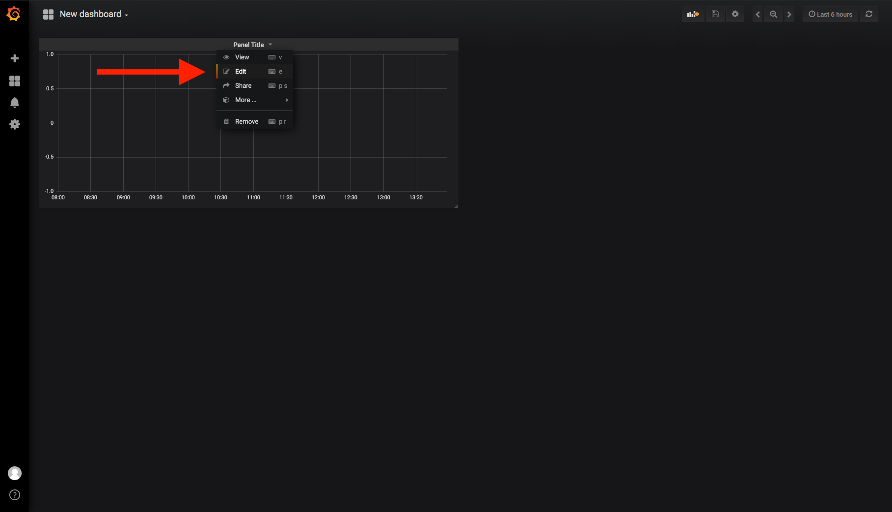
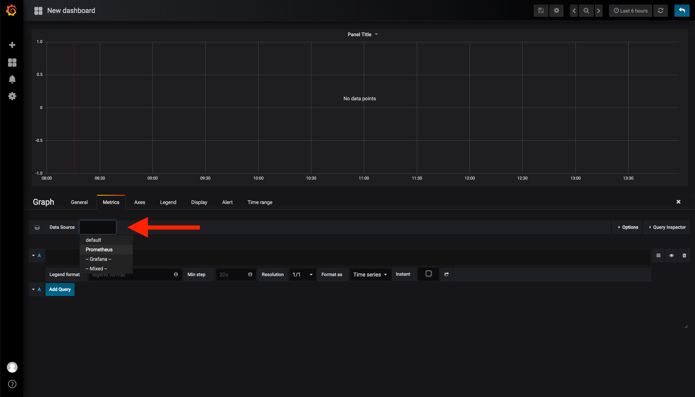
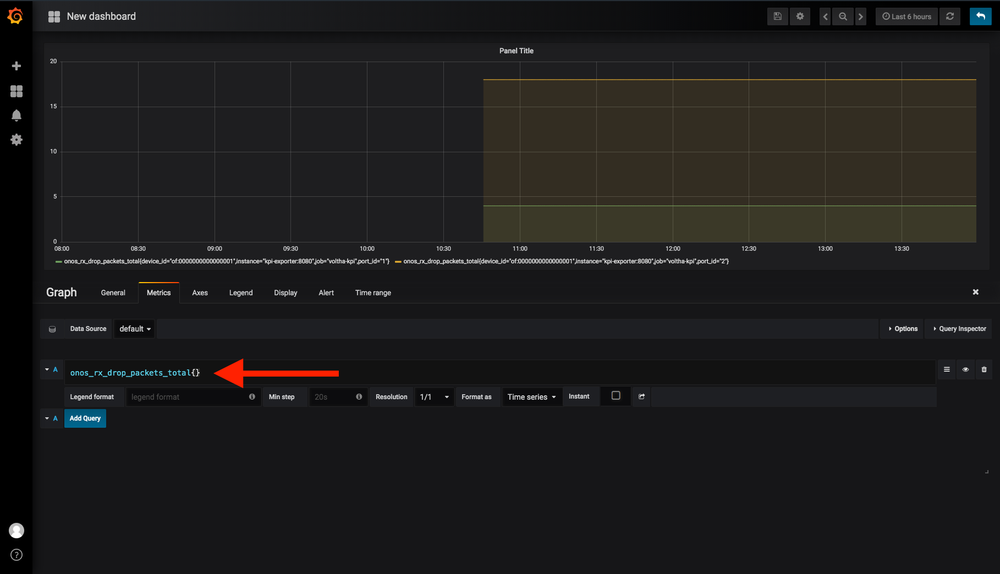
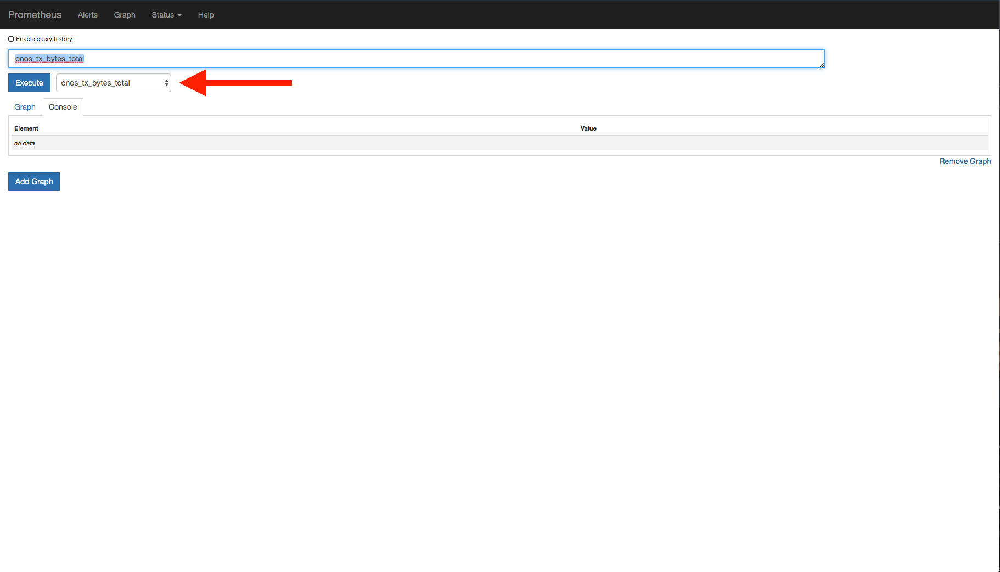
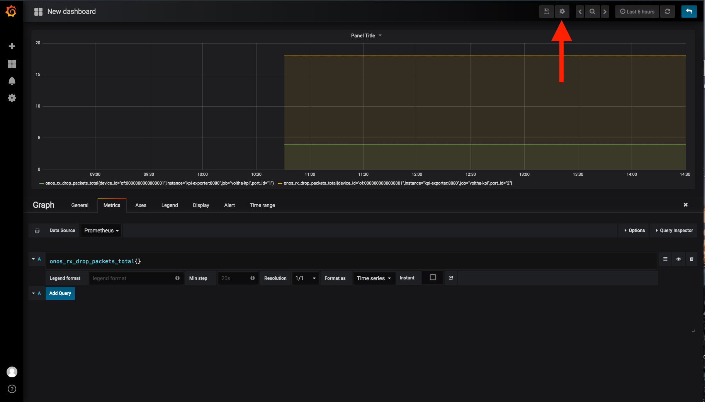
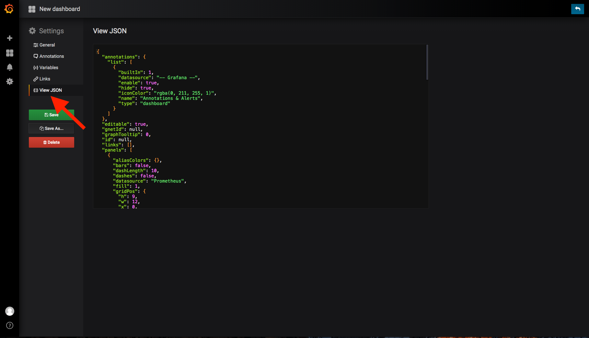

# Prometheus

> In order to use Elastic Stack the `nem-monitoring` helm-chart needs to be installed.
> That is part of the `cord-platform` helm-chart, but if you need to install it,
> please refer to [this guide](../charts/logging-monitoring.md#nem-monitoring-charts).

CORD uses Prometheus for storing time-series metrics related to the POD usage.
Within Prometheus you'll find statistics related to traffic through the hardware and metrics
about operational requests made to the pod.

On a running POD, Prometheus can be accessed at `http://<pod-ip>:31301`,
but we suggest to utilize Grafana that already provides custom CORD
dashboards, and is accessible at `http://<pod-ip>:31301`.

Unless you customized the chart installation, the credentials to access Grafana are:

```yaml
username: admin
password: strongpassword
```

## Visualize an existing dashboard in Grafana

Once you are logged in Grafana you can list the existing dashboards by selecting the `Home`
dropdown menu on the top left of the window:



Then select the dashboard you are interested in simply by clicking on it:



## I want to create a new visualization

That's **great**! Let's get started.

To create a new dashboard select the `+` sign in the Grafana sidebar and select Dashboard



Then select the kind of visualization you want to add to that dashboard



Once it has been added, click on the `edit` item in the panel dropdown



Now it's time to create the query that will populate the graph.

The first thing to do is to select the `Data Source`



And then create the query to display the metric you are interested into



> In order to write a meaningful query we suggest to consult the
> [Prometheus documentation](https://prometheus.io/docs/prometheus/latest/querying/basics/)

To find the list of metrics that are available in Prometheus open the Prometheus dashboard
at `http://<pod-ip>:31301/graph` and look them up in the dropdown



## I want to save the new dashboard and make it available in CORD

That's even **better**! Here's what you need to do.

The CORD Grafana dashboard are made available through `configmaps` defined in the
[`nem-monitoring`](https://github.com/opencord/helm-charts/tree/master/nem-monitoring/grafana-dashboards) helm chart.

So the first thing to do is obtain the `.json` export of the dashboard.

To do that click on the `Setting` icon on the top right of the screen



then click on `View JSON` and copy the json into a file



then you need to save the file in `~/cord/helm-charts/nem-monitoring/grafana-dashboards`,
for this example we'll name that file `my_dashboard.json`.

In order to load that dashboard into Grafana at startup create a new `configmap` in
`~/cord/helm-charts/nem-monitoring/templates/grafana-dashboard-my-dashboard-configmap.yaml`
with the following content:

```yaml
apiVersion: v1
kind: ConfigMap
metadata:
  name: grafana-dashboard-my-dashboard
  labels:
     grafana_dashboard: "1"
data:
  kb8s.json: |
{{ .Files.Get "grafana-dashboards/my_dashboard.json" | indent 4 }}
```

## REST APIs based queries

In some cases you want to fetch some data from Prometheus via REST, following are some examples of the
queries you can achieve, but we strongly suggest to refer to the [official documentation](https://prometheus.io/docs/prometheus/latest/querying/api/)

### Get the latest values of a metric

```bash
curl -X GET -G http://10.128.22.1:31301/api/v1/query \
--data-urlencode 'query=onos_rx_bytes_total' | jq .
```

Example response:

```json
{
  "status": "success",
  "data": {
    "resultType": "vector",
    "result": [
      {
        "metric": {
          "__name__": "onos_rx_bytes_total",
          "device_id": "of:0000000000000001",
          "instance": "kpi-exporter:8080",
          "job": "voltha-kpi",
          "port_id": "1"
        },
        "value": [
          1559256189.732,
          "3842"
        ]
      },
      {
        "metric": {
          "__name__": "onos_rx_bytes_total",
          "device_id": "of:0000000000000001",
          "instance": "kpi-exporter:8080",
          "job": "voltha-kpi",
          "port_id": "2"
        },
        "value": [
          1559256189.732,
          "496584"
        ]
      }
    ]
  }
}

```

### Get the latest values of a metric with a filter

```bash
curl -X GET -G http://10.128.22.1:31301/api/v1/query \
--data-urlencode 'query=onos_rx_bytes_total{device_id="of:0000000000000001", port_id="1"}' | jq .
```

Example response:

```json
{
  "status": "success",
  "data": {
    "resultType": "vector",
    "result": [
      {
        "metric": {
          "__name__": "onos_rx_bytes_total",
          "device_id": "of:0000000000000001",
          "instance": "kpi-exporter:8080",
          "job": "voltha-kpi",
          "port_id": "1"
        },
        "value": [
          1559256175.475,
          "3842"
        ]
      }
    ]
  }
}

```

### Get the values of a metric with filters and a time range

```bash 
export START=$(date -d '1 minute ago' -u +"%Y-%m-%dT%H:%M:%SZ")
export END=$(date -u +"%Y-%m-%dT%H:%M:%SZ")


curl -X GET -G 'http://10.128.22.1:31301/api/v1/query_range' \
--data-urlencode 'query=onos_rx_bytes_total{device_id="of:0000000000000001", port_id="1"}' \
--data-urlencode start=$START \
--data-urlencode end=$END \
--data-urlencode step=15s | jq .
```

Example response:

```json
{
  "status": "success",
  "data": {
    "resultType": "matrix",
    "result": [
      {
        "metric": {
          "__name__": "onos_rx_bytes_total",
          "device_id": "of:0000000000000001",
          "instance": "kpi-exporter:8080",
          "job": "voltha-kpi",
          "port_id": "1"
        },
        "values": [
          [
            1559255865,
            "3842"
          ],
          [
            1559255880,
            "3842"
          ],
          [
            1559255895,
            "3842"
          ],
          [
            1559255910,
            "3842"
          ],
          [
            1559255925,
            "3842"
          ]
        ]
      }
    ]
  }
}
```

