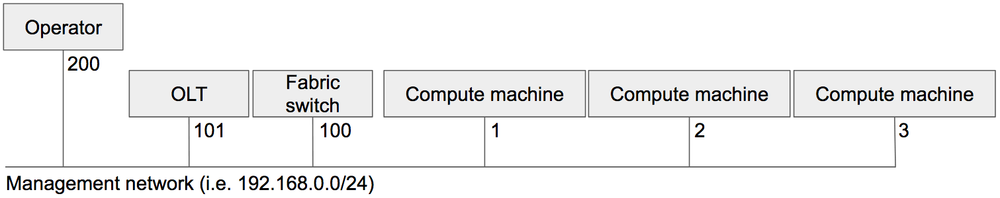
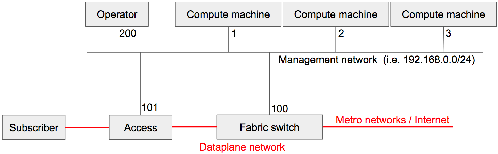

# Connectivity Requirements

CORD expects two networks: a management network (for control traffic between the control plane containers) and a dataplane network (for end-user traffic).

## Management Network

The management network that connects all physical devices (compute machines,
fabric switches, access devices, development machines), allowing them to
communicate to manage CORD. This is usually a 1G copper network, but may
vary deployment by deployment. Network devices (access devices and fabric
switches) usually connect to this network through a dedicated management 1G port.
If everything is setup correctly, any device should be able to communicate with the others at L3 (i.e., devices should ping one each other).

The management network is usually used to access Internet for the underlay
infrastructure setup, although CORD doesn't require Internet access. For
example, you will likely need to have Internet access through this network to
install or update your OS, switch software, Kubernetes, and so on.

The following is a diagram of a typical management network.

## Dataplane Network

The dataplane network carries the users' traffic, connecting subscribers to the
Internet (which is the whole purpose of CORD). The following is a diagram of a
reference dataplane network for CORD.

