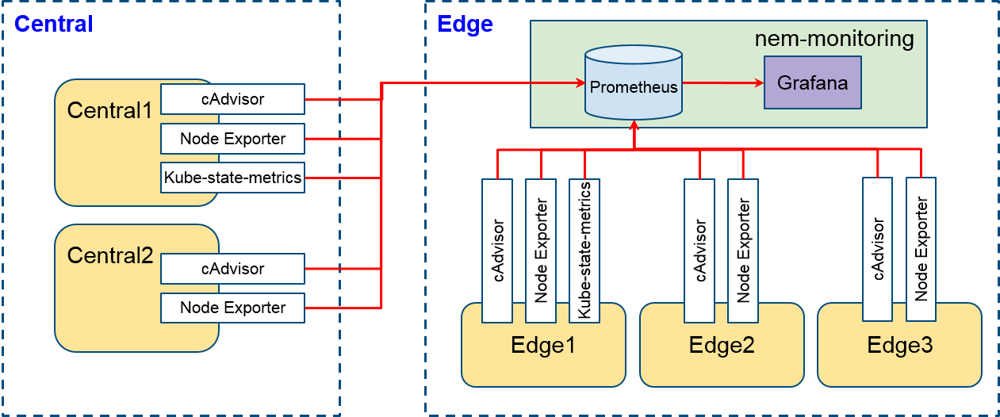
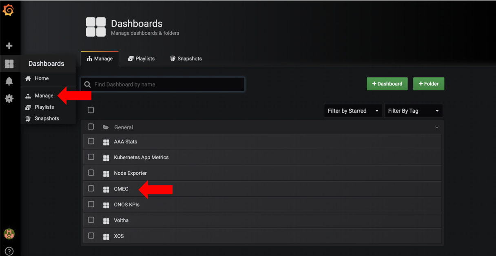
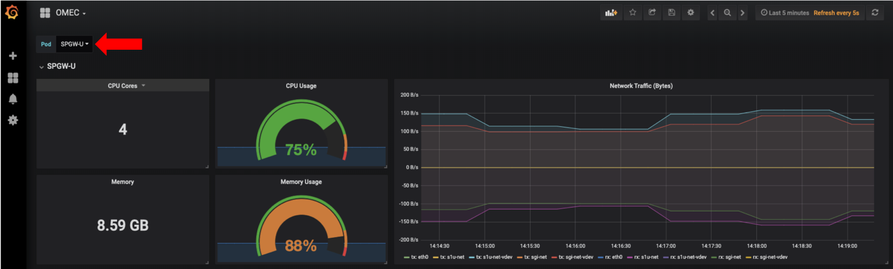

# Configure Grafana-via-Prometheus

Basically, COMAC is configured with monitoring and logging capabilities which is same as using CORD. If you would like to know the general monitoring and logging systems, they are introduced in [Operation Guides](https://guide.opencord.org/operating_cord/diag.html).

This page shows how to configure Grafana-via-Prometheus for COMAC monitoring. The default monitoring system for CORD is also working well in COMAC. However, The default monitoring does not handle multi-cluster so if you want to configure the monitoring system for COMAC, please refer to this page.

## Grafana-via-Prometheus for COMAC monitoring

In COMAC, we are using `nem-monitoring` chart for monitoring. The chart is part of the `cord-platform` helm-chart, but if you need to install it, please refer to [this guide](https://guide.opencord.org/charts/logging-monitoring.html#nem-monitoring-charts).

`nem-monitoring` includes Grafana, Prometheus, and metrics exporters. The chart is capable for monitoring and visualization in single cluster by default. However, if you want to deploy COMAC on multi-cluster, the monitoring system should pull metrics from multi-cluster.

### Metrics exporter deployment

It depends on exporters which metrics are exposed. The exposed metrics are collected and stored in Prometheus then the metrics can be used by Grafana to create dashboards. In COMAC environment, we basically deploy 3 exporters as follows.

- [cAdvisor](https://github.com/google/cadvisor)
- [Kube-state-metrics](https://github.com/kubernetes/kube-state-metrics)
- [Node-exporter](https://github.com/prometheus/node_exporter)

They expose resource usage and performance characteristics of running containers, metrics about Kubernetes objects, and hardware/OS metrics. Basically, the monitoring system including Grafana, Prometheus, and metrics exporters in the edge cluster. Thus, we should deploy exporters in the central cluster and make the monitoring system interacts with them as following figure.




### Prometheus configuration

Promethues is responsible for pulling and storing metrics which can be used by Grafana. When the monitoring system is deployed, Prometheus is also deployed by default. The `nem-monitoring` chart enables Prometheus to pull metrics from the edge cluster but it does not from the central cluster. To pull metrics from the central cluster, `/path/to/helm-charts/nem-moniitoring/values.yaml` should be configured. To pull metrics from the central cluster, a pulling job should be defined like below:

```text
...
prometheus:
    prometheus.yml:
        scrape_configs:
          # Pulling metrics from the central cluster
          - job_name: 'central-cluster-monitoring'
            metrics_path: /metrics
            scrape_interval: 15s
            static_configs:
              - targets:
                - {PUT_NODE_IP}:{PUT_CADVISOR_NODE_PORT}
                - {PUT_NODE_IP}:{PUT_NODE_EXPORTER_NODE_PORT}
                - {PUT_NODE_IP}:{PUT_KUBE_STATE_METRICS_NODE_PORT}
            metric_relabel_configs:
            - source_labels: ['container_label_io_kubernetes_pod_name']
              replacement: '$1'
              target_label: pod_name
...
```

You can put node IPs located in the central cluster and port numbers in `targets` then Prometheus pulls metrics from the endpoints. Moreover, `metric_relabel_configs` is an option to modify metrics label. In this example, we modify `container_label_io_kubernetes_pod_name` label to `pod_name` which is used to create the OMEC dashboard.

### Default dashboards

The latest `nem-monitoring` (>= v1.0.14) chart includes several default dashboards. Once you are logged in Grafana you can list the existing dashboards.



Among them, OMEC dashboard shows metrics about OMEC components which are distributed on multi-cluster (control plan in the central cluster and data plane in the edge cluster). When you choose one of OMEC components on the dashboard, it shows requested resources (CPU cores and memory), current usage, and ingress/egress traffic by OMEC pods as the following figure.

