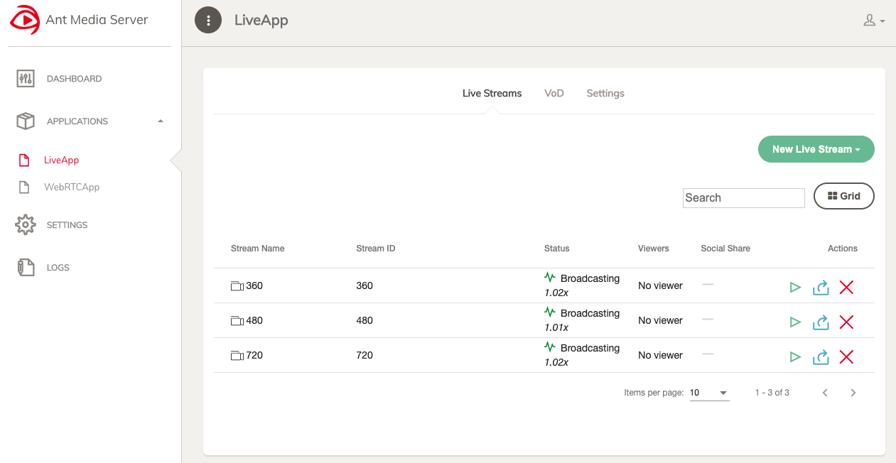

# Install CDN charts

This page shows how to install CDN Helm charts which include the CDN-Local chart and the CDN-Remote chart.

## Preliminaries

In order to deploy CDN Helm charts, there are following preliminaries:

* The Kubernetes cluster should be able to use SR-IOV CNI, since the CDN-Local Helm chart requires SR-IOV.
* Before installing CDN Helm charts, the OMEC data plane should be installed.

## Multi-cluster & single-cluster environments

The CDN in COMAC release supports both multi-cluster and single-cluster environments.

### Installing CDN Helm charts in multi-cluster environment

It assumes that there are multiple Kubernetes clusters: (i) One is an edge cluster and (ii) the others are central clusters. CDN-Local Helm chart will be deployed on the edge cluster, whereas CDN-Remote Helm chart will be installed on the central clusters. Like OMEC installation, use `--kube-context` option when installing each chart. See [here](https://kubernetes.io/docs/tasks/access-application-cluster/configure-access-multiple-clusters/) how to configure access to multiple Kubernetes cluster.

#### 1. Add CORD Helm chart repository on edge and central clusters

```bash
helm repo add cord https://charts.opencord.org
helm repo update
```

#### 2. Deploy `CDN-Remote` in each central cluster

Deploy CDN-Remote Helm chart with the command:

```bash
helm install cord/cdn-remote \
  --kube-context central \
  --namespace omec \
  --name cdn-remote
```

#### 3. Make `cdn_var.yaml` file in the edge cluster

Next, make `cdn_var.yaml` file which includes information of CDN-Remotes. For example, if there is two central clusters which operate a CDN-Remote for each, we can write `cdn_var.yaml` like below:

```bash
config:
  cdnRemotes:
  - name: remote-1
    ip: 10.90.0.131 # One of the central cluster node IP address
    port: 30935
    streams: # Video streams from CDN-Remote
    - name: 360p
      value: 360
    - name: 480p
      value: 480
    - name: 720p
      value: 720
  - name: remote-2
    ip: 10.90.1.131 # One of the central cluster node IP address
    port: 30935
    streams: # Video streams from CDN-Remote
    - name: 360p
      value: 360
    - name: 480p
      value: 480
    - name: 720p
      value: 720
```

#### 4. Deploy `CDN-Local` in the edge cluster

Deploy CDN-Local Helm chart with the following command:

```bash
helm install cord/cdn-local \
  --kube-context edge \
  --namespace omec \
  --name cdn-local \
  --values /path/to/cdn_var.yaml
```

### Installing CDN Helm charts in single-cluster environment

This environment has a single cluster which will have both CDN-Local and CDN-Remote, simultaneously.

#### 1. Add CORD Helm chart repository on the cluster

```bash
helm repo add cord https://charts.opencord.org
helm repo update
```

#### 2. Deploy `CDN-Remote` in the cluster

Deploy CDN-Remote Helm chart with the command:

```bash
helm install cord/cdn-remote \
  --namespace omec \
  --name cdn-remote
```

#### 3. Make `cdn_var.yaml` file in the cluster

In the cluster, make `cdn_var.yaml` file which includes information of CDN-Remote. Since each cluster has a single CDN-Remote, `cdn_var.yaml` file has information of only single CDN-Remote:

```bash
config:
  cdnRemotes:
  - name: remote-1
    ip: 10.90.0.131 # One of the cluster node IP address
    port: 30935
    streams: # Video streams from CDN-Remote
    - name: 360p
      value: 360
    - name: 480p
      value: 480
    - name: 720p
      value: 720
```

#### 4. Deploy `CDN-Local` in the cluster

Deploy CDN-Local Helm chart with the following command:

```bash
helm install cord/cdn-local \
  --namespace omec \
  --name cdn-local \
  --values /path/to/cdn_var.yaml
```

## Verification

### CDN-Local deployment

Once CDN-Local Helm was deployed, run the following command on the cluster where CDN-Local is running:

```bash
kubectl get pods -n omec
```

Then, there is a `nginx` POD.

```bash
NAME                                                              READY   STATUS      RESTARTS   AGE
nginx-0                                                           1/1     Running     0          100m
```

### CDN-Remote deployment

Likewise, run the following command on the cluster where CDN-Remote is running:

```bash
kubectl get pods -n omec
```

If CDN-Remote is running, there are two PODs, `ant-media` and `video-archive`.

```text
NAME                                                              READY   STATUS      RESTARTS   AGE
ant-media-0                                                       1/1     Running     0          100m
video-archive-0                                                   3/3     Running     0          100m
```

### Ant Media UI

If CDN-Remote is running without any problem, users can access Ant Media Web UI:

```text
http://<any computing node IP address in the cluster which has CDN-Remote>:32080
```



NOTE: Sometimes, this Web UI will response, belatedly. Then, please refresh again.

## How to play video?

In order to play video, UEs should be connected with OMEC EPC through eNodeB (eNB). Also, UEs should contain a video player application like VLC or MXPlayer.

### Play cached video files

Turn on the video player application and go to `video streaming` menu. Then, write the following URLs.

* To play 360p cached video file: rtmp://&lt;NGINX IP address&gt;:1935/l/360.mp4
* To play 480p cached video file: rtmp://&lt;NGINX IP address&gt;:1935/l/480.mp4
* To play 720p cached video file: rtmp://&lt;NGINX IP address&gt;:1935/l/720.mp4

NOTE: SPGW-U IP address should be 13.1.1.253 by default.

### Play remote video files

Turn on the video player application and go to `video streaming` menu. Then, write the following URLs.

* To Play 360p video file in CDN-Remote: rtmp://&lt;NGINX IP address&gt;:1935/r/&lt;CDN-Remote name&gt;/360
* To Play 480p video file in CDN-Remote: rtmp://&lt;NGINX IP address&gt;:1935/r/&lt;CDN-Remote name&gt;/480
* To Play 720p video file in CDN-Remote: rtmp://&lt;NGINX IP address&gt;:1935/r/&lt;CDN-Remote name&gt;/720

NOTE: NGINX IP address should be 13.1.1.253 by default. Also, CDN-Remote name is defined in `cdn_var.yaml` file which was used to deploy the CDN-Local Helm chart before. In the above example `cdn_var.yaml` file, one of CDN-Remote name is remote-1.

## Troubleshooting

### `nginx-0` POD in Pending status, infinitely

When `nginx-0` POD is in `Pending` status for a long time, it would be `SR-IOV` problem. To check whether this is `SR-IOV` problem or not, please run the following command on the cluster on which CDN-Local is running:

```bash
$ kubectl config use-context edge # run if nginx-0 is running in the multi-cluster environment
$ kubectl describe pod nginx-0 -n omec

...
Events:
  Type     Reason            Age                From               Message
  ----     ------            ----               ----               -------
  Warning  FailedScheduling  18s (x2 over 18s)  default-scheduler  0/3 nodes are available: 3 Insufficient intel.com/sriov_netdevice.
```

The warning message at the bottom means that the `nginx-0` POD requires SR-IOV NetDevice VFs but there is no sufficient VFs now in any computing machine.

Then, please check whether `sriov-device-plugin` PODs are running or not:

```bash
$ kubectl config use-context edge # run if nginx-0 is running in the multi-cluster environment
$ kubectl get pods -n omec | grep sriov-device-plugin

sriov-device-plugin-k456h                                         1/1     Running     0          1h
sriov-device-plugin-mmrzf                                         1/1     Running     0          1h
sriov-device-plugin-s5h9d                                         1/1     Running     0          1h
```

NOTE: If the OMEC data plane was deployed before, `sriov-device-plugin` should be running in the edge cluster. In addition, the number of `sriov-device-plugin` is equal to the number of computing nodes in the edge cluster. The reason is that each computing node in the edge cluster should have a single `sriov-device-plugin` POD.

If `sriov-device-plugin` POD is not running on each computing node, it means that `OMEC-data-plane` is deployed unsuccessfully or even not deployed. If so, please redeploy OMEC again.

However, if there is an `sriov-device-plugin` on each computing node, please run the following command to check whether SR-IOV NetDevice is ready or not:

```text
$ kubectl config use-context edge # run if nginx-0 is running in the multi-cluster environment
$ kubectl get nodes -o json | jq '.items[].status.allocatable'

{
  "cpu": "39800m",
  "ephemeral-storage": "1062296854818",
  "hugepages-1Gi": "32Gi",
  "intel.com/sriov_netdevice": "0",
  "intel.com/sriov_vfio": "0",
  "memory": "162611552Ki",
  "pods": "110"
}
{
  "cpu": "39800m",
  "ephemeral-storage": "1062296854818",
  "hugepages-1Gi": "32Gi",
  "intel.com/sriov_netdevice": "8", <- Here is the number of SR-IOV NetDevice VFs
  "intel.com/sriov_vfio": "0",
  "memory": "162611568Ki",
  "pods": "110"
}
{
  "cpu": "39800m",
  "ephemeral-storage": "1062296854818",
  "hugepages-1Gi": "32Gi",
  "intel.com/sriov_netdevice": "0",
  "intel.com/sriov_vfio": "64",
  "memory": "162611568Ki",
  "pods": "110"
}
```

When the number of SR-IOV NetDevice VFs is less than 3, then SR-IOV Netdevice is unsuccessfully set. Please run the following command on the machine **which has `intel.com/sriov_vfio` as 0** (in this case, the first machine or the second machine; not the third machine):

```bash
echo '8' > /sys/class/net/<interface name like eth2>/device/sriov_numvfs
```

See [here](https://guide.opencord.org/profiles/comac/install/prerequisites.html#sr-iov-setup) to set SR-IOV in detail.

### Other problem?

Please tell `woojoong.kim` on `CORD` Slack channel if you see any problem.
