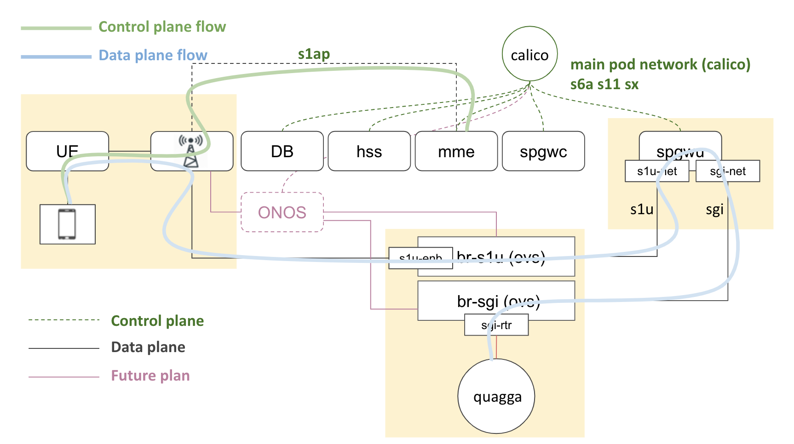

# COMAC-in-a-Box

If you do not have the [prerequisite hardware](../../../prereqs/hardware.md) to
install COMAC we have you covered. You can get a complete CORD system together
with the CORD platform, OMEC, COMAC profile, and an emulated data-plane using
COMAC-in-a-Box (CiaB).

CiaB is a functional COMAC pod capable of running E2E tests. It takes about 25
minutes to install on a physical server or VM.

The default configuration of CiaB incorporates an emulated RAN provided by
OpenAirInterface L2 nFAPI simulator and an emulated data plane switches provided
by Open vSwitch. Open vSwitch is also configured with Quagga that stands in
upstream router. The OAI simulator installs a single eNB and UE. The UE
authenticates itself and attaches to the network through MME with subscriber
information registered in HSS database, gets an IP address from SPGWC, and
finally ping the upstream router. This demonstrates end-to-end connectivity
between the UE and the upstream router via the eNB, SPGWU, and data plane switches.



## Requirements

CiaB can be deployed on any x86 machine, either physical or virtual. The server
of VM on which you are installing CiaB should have at least 4 cores of Intel
Haswell or newer CPU, and 8GB of RAM, and 30GB disk space. Kernel version 4.15
or later is also required to run OAI simulator properly.

## Quick start

A Makefile can be used to install COMAC-in-a-Box in an automated manner on an
Ubuntu 16.04 or later system:

```bash
git clone https://gerrit.opencord.org/automation-tools
cd automation-tools/comac-in-a-box
make
```

## Installation procedure

The rest of this page describes a manual method for installing COMAC-in-a-Box.
It also provides an overview of what is installed by each chart.

### Kubernetes

Before installing COMAC, you need a Kubernetes cluster with Helm and a few
other software packages. You also need to install Multus CNI plugin, enable
SCTP support, and change the NodePort range. An easy way to set up a single-node
Kubernetes that meets the requirements is with [Kubespray](https://github.com/kubernetes-sigs/kubespray).

Here’s an example of installing Kubernetes with Kubespray on an Ubuntu 16.04 and 18.04 server:

```bash
# Download Kubespray
cd ${HOME}
git clone https://github.com/kubernetes-incubator/kubespray.git -b release-2.11

# Create Python virtual environment for Kubespray
sudo apt update
sudo apt install -y software-properties-common python-pip
sudo pip install virtualenv
virtualenv ${HOME}/venv/ciab --no-site-packages
source ${HOME}/venv/ciab/bin/activate

# Run Kubespray
cd ${HOME}/kubespray
pip install -r requirements.txt
ansible-playbook -b -i inventory/local/hosts.ini \
    -e "{'override_system_hostname' : False, 'disable_swap' : True}" \
    -e "{'docker_iptables_enabled' : True}" \
    -e "{'kube_network_plugin_multus' : True, 'multus_version' : stable}" \
    -e "{'kube_apiserver_node_port_range' : 2000-36767}" \
    -e "{'kube_feature_gates' : [SCTPSupport=True]}" \
    -e "{'helm_enabled' : True}" \
    cluster.yml
deactivate

# Copy the cluster config to user home
mkdir -p ${HOME}/.kube
sudo cp -f /etc/kubernetes/admin.conf ${HOME}/.kube/config
sudo chown $(id -u):$(id -g) ${HOME}/.kube/config

# Init Helm and add additional Helm repositories
helm init --wait --client-only
helm repo add incubator https://kubernetes-charts-incubator.storage.googleapis.com/
helm repo add cord https://charts.opencord.org
```

### Other prerequisites

Install the http and jq commands. Run: `sudo apt install -y jq`

Install additional CNI plugins.

```bash
cd ${HOME}
git clone https://gerrit.opencord.org/automation-tools
sudo cp ${HOME}/automation-tools/comac-in-a-box/resources/simpleovs /opt/cni/bin/

mkdir -p /tmp/cni-plugins
cd /tmp/cni-plugins
wget https://github.com/containernetworking/plugins/releases/download/v0.8.2/cni-plugins-linux-amd64-v0.8.2.tgz
tar xvfz cni-plugins-linux-amd64-v0.8.2.tgz
sudo cp /tmp/cni-plugins/static /opt/cni/bin/
```

Set up the emulated data plane which includes two OVS bridges and Quagga pod.

```bash
# Set up OVS bridges
sudo apt install -y openvswitch-switch
sudo ovs-vsctl --may-exist add-br br-s1u-net
sudo ovs-vsctl --may-exist add-port br-s1u-net s1u-enb -- set Interface s1u-enb type=internal
sudo ip addr add 119.0.0.4/24 dev s1u-enb
sudo ip link set s1u-enb up

# Set up Quagga
kubectl apply -f ${HOME}/automation-tools/comac-in-a-box/resources/router.yaml
kubectl wait pod -n default --for=condition=Ready -l app=router --timeout=300s
kubectl -n default exec router ip route add 16.0.0.0/8 via 13.1.1.3
kubectl delete net-attach-def sgi-net
```

### Get CORD platform and COMAC Helm Charts

Before we can start installing COMAC components, we need to get the charts.

```bash
cd ${HOME}
mkdir -p cord; cd cord
git clone https://gerrit.opencord.org/helm-charts
git clone https://gerrit.opencord.org/cord-platform
git clone https://gerrit.opencord.org/comac-helm-charts
```

### Install CORD platform and COMAC profile

Run these commands:

```bash
cd ${HOME}/cord/cord-platform
helm dep update cord-platform
helm upgrade --install cord-platform cord-platform --set etcd-operator.enabled=false
cd ${HOME}/cord/comac-helm-charts
helm dep update comac-platform
helm upgrade --install comac-platform comac-platform
```

You should see the following pods running about 5 min later.
Note that the pods may periodically transition into error state. This is expected.
They will retry and eventually get to the desired state:

```bash
$ kubectl get pod
NAME                                                           READY   STATUS      RESTARTS   AGE
comac-platform-base-kubernetes-tosca-loader-kbht5              0/1     Completed   0          4m34s
comac-platform-fabric-57c79f966d-sgm7s                         1/1     Running     0          4m34s
comac-platform-kubernetes-5b56c97fcc-chjml                     1/1     Running     0          4m34s
comac-platform-mcord-subscriber-ft6tn                          0/1     Completed   0          4m34s
comac-platform-mcord-tosca-loader-ghc45                        0/1     Completed   1          4m34s
comac-platform-onos-service-78855b85bf-bn2ts                   1/1     Running     0          4m34s
comac-platform-vrouter-7f77b8c68f-pdqml                        1/1     Running     0          4m34s
cord-platform-elasticsearch-client-75c6846fc6-vm6gp            0/1     Running     0          5m52s
cord-platform-elasticsearch-data-0                             0/1     Running     0          5m51s
cord-platform-elasticsearch-master-0                           0/1     Running     0          5m51s
cord-platform-grafana-846c6df66-j8s9d                          2/2     Running     0          5m52s
cord-platform-kafka-0                                          1/1     Running     1          5m51s
cord-platform-kibana-7888878b87-nb25l                          1/1     Running     0          5m52s
cord-platform-logstash-0                                       1/1     Running     0          5m51s
cord-platform-onos-d4d6896f7-l8fp9                             2/2     Running     0          5m52s
cord-platform-prometheus-alertmanager-c84bbf548-j522m          2/2     Running     0          5m52s
cord-platform-prometheus-kube-state-metrics-5bd49cbb6c-ssqxk   1/1     Running     0          5m52s
cord-platform-prometheus-node-exporter-zgqld                   1/1     Running     0          5m52s
cord-platform-prometheus-pushgateway-6795f848dd-thzwv          1/1     Running     0          5m52s
cord-platform-prometheus-server-86c7b5cc77-jzkzt               1/2     Running     0          5m52s
cord-platform-zookeeper-0                                      1/1     Running     0          5m52s
kpi-exporter-66f8698468-jqd2h                                  1/1     Running     1          5m52s
kpi-exporter-66f8698468-mjf4b                                  1/1     Running     1          5m52s
router                                                         1/1     Running     0          2m19s
xos-chameleon-6754f7bcd8-j6vrk                                 1/1     Running     0          5m51s
xos-core-5d67b6dc49-kxv8d                                      1/1     Running     0          5m51s
xos-db-66f95c59c7-mzhrs                                        1/1     Running     0          5m51s
xos-gui-5ffb4b4474-bqmlh                                       1/1     Running     0          5m51s
xos-tosca-f5468cc74-km7qk                                      1/1     Running     0          5m51s
xos-ws-7746c588d9-k8d28                                        1/1     Running     0          5m51s
```

### Install OMEC

Befor releasing OMEC charts to the cluster, you will need to override some
default values of OMEC charts for OMEC components to work properly with the
OpenAirInterface simulator and the emulated data plane.

```bash
cd ${HOME}
cat >> omec-values.yaml << EOF
resources:
  enabled: false
cassandra:
  config:
    cluster_size: 1
    seed_size: 1
config:
  sriov:
    enabled: false
  spgwu:
    devices: "--no-pci --vdev eth_af_packet0,iface=s1u-net --vdev eth_af_packet1,iface=sgi-net"
  hss:
    bootstrap:
      users:
      - imsi: "208014567891201"
        msisdn: "1122334455"
        apn: apn1
        key: "465b5ce8b199b49faa5f0a2ee238a6bc"
        opc: "d4416644f6154936193433dd20a0ace0"
networks:
  cniPlugin: simpleovs
  ipam: static
EOF
```

Release OMEC data plane and control plane with the override values above:

```bash
cd ${HOME}/cord/helm-charts/omec
helm upgrade --install omec-data-plane omec-data-plane --namespace omec -f ${HOME}/omec-values.yaml
helm dep up omec-control-plane
helm upgrade --install omec-control-plane omec-control-plane --namespace omec -f ${HOME}/omec-values.yaml
```

You should see the following pods running about 3 min later in `omec` namespace:

```bash
$ kubectl get pod -n omec
NAME                      READY   STATUS      RESTARTS   AGE
cassandra-0               1/1     Running     0          113s
hss-0                     1/1     Running     0          113s
job-hss-bootstrap-29jgh   0/1     Completed   0          113s
job-hss-db-sync-fggjp     0/1     Completed   0          113s
mme-0                     4/4     Running     0          113s
spgwc-0                   1/1     Running     0          113s
spgwu-0                   1/1     Running     0          2m4s
```

### Build OpenAirInterface UE image

Run these commands to build OAI UE image:

```bash
cd ${HOME}
git clone https://github.com/opencord/openairinterface.git
cd ${HOME}/openairinterface
sudo docker build . --target lte-uesoftmodem \
    --build-arg build_base=omecproject/oai-base:1.0.0 \
    --file Dockerfile.ue \
    --tag omecproject/lte-uesoftmodem:1.0.0
```

### Install OpenAirInterface simulator

Similar to OMEC, you will need to override some default values of OAI chart.

```bash
cd ${HOME}
cat >> oai-values.yaml << EOF
config:
  enb:
    mme:
      address: 127.0.0.1
    networks:
      s1u:
        interface: s1u-enb
  plmn:
    mcc: "208"
    mnc: "01"
    mnc_length: 2
  ue:
    sim:
      msin: "4567891201"
      api_key: "465b5ce8b199b49faa5f0a2ee238a6bc"
      opc: "d4416644f6154936193433dd20a0ace0"
      msisdn: "1122334456"
EOF
```

Run these commands to install OpenAirInterface eNB and UE:

```bash
sudo ip addr add 127.0.0.2/8 dev lo
mme_iface=$(ip -4 route list default | awk -F 'dev' '{ print $2; exit }' | awk '{ print $1 }')

cd ${HOME}/cord/helm-charts
helm upgrade --install --namespace omec oaisim oaisim -f ${HOME}/oai-values.yaml --set config.enb.networks.s1_mme.interface=${mme_iface}
```

You should see `enb-0` and `ue-0` pods running about 3 min later in `omec` namespace:

```bash
kubectl get po -n omec
NAME                      READY   STATUS      RESTARTS   AGE
cassandra-0               1/1     Running     0          19m
enb-0                     1/1     Running     0          2m26s
hss-0                     1/1     Running     0          19m
job-hss-bootstrap-29jgh   0/1     Completed   0          19m
job-hss-db-sync-fggjp     0/1     Completed   0          19m
mme-0                     4/4     Running     0          19m
spgwc-0                   1/1     Running     0          19m
spgwu-0                   1/1     Running     0          19m
ue-0                      1/1     Running     0          2m26s
```

## Validating the install

### Attach UE to the network

Once `ue-0` pod is up and running, it immediately sends an attachment request to
the network. You can varify the success of the attachment by checking the IP
address of `oip1` interface, which represents an UE. If the `oip1` interface is
assigned an IP address, you could consider the attachment was successful.

```bash
ip addr show oip1
186: oip1: <BROADCAST,MULTICAST,NOARP,UP,LOWER_UP> mtu 1500 qdisc pfifo_fast state UNKNOWN group default qlen 100
    link/generic 00:00:00:00:00:00:00:00 brd 00:00:00:00:00:00:00:00
    inet 16.255.255.254/8 brd 16.255.255.255 scope global oip1
       valid_lft forever preferred_lft forever
```

### Ping the emulated upstream router from UE

At first, it may take some time to get successful ping response due to the
delays in `SPGWU` processing ARP packets.

```bash
ping -I oip1 13.1.1.254
PING 13.1.1.254 (13.1.1.254) from 16.255.255.254 oip1: 56(84) bytes of data.
64 bytes from 13.1.1.254: icmp_seq=1 ttl=64 time=13.0 ms
64 bytes from 13.1.1.254: icmp_seq=2 ttl=64 time=40.2 ms
64 bytes from 13.1.1.254: icmp_seq=3 ttl=64 time=21.2 ms

--- 13.1.1.254 ping statistics ---
3 packets transmitted, 3 received, 0% packet loss, time 2001ms
rtt min/avg/max/mdev = 13.074/24.877/40.270/11.389 ms
```

That’s it. Currently it’s not possible to send traffic to destinations on the Internet.

## Uninstall COMAC-in-a-Box

If you're done with your testing, the easiest way to remove a CiaB installation
is to use the `make clean` target. If you want to remove the COMAC components
only for testing your patchsets on OMEC helm charts or OMEC images, run
`make reset-test` target and then `make` again to reinstall.

## Getting help

Report any problems to `hyunsun` on the CORD Slack channel.
