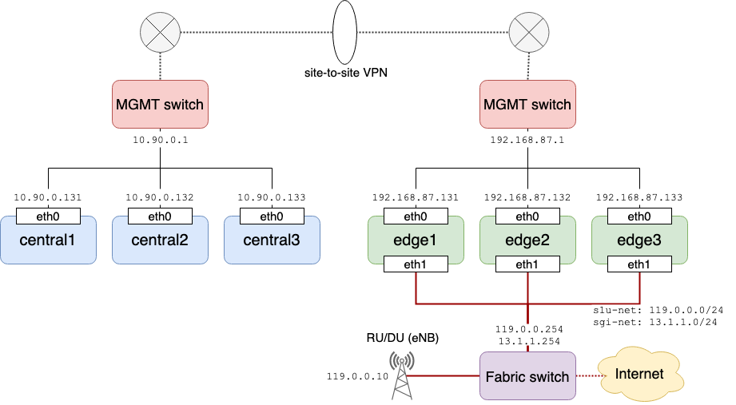

# Prerequisites

This page describes prerequisites for deploying COMAC, which includes:

* Hardware Requirements
* Connectivity Requirements
* Software Requirements

Before proceeding further, pelease read general [CORD prerequisites](../../../prereqs/README.md) first.
This page addresses COMAC specific settings only based on the general
requirements.

## Hardware Requirements

Hardware requirements and COMAC BOM are described in [this page](../../../prereqs/hardware.md).

## Connectivity Requirements

Read [this page](https://guide.opencord.org/prereqs/networking.html) first for the
general connectivity requirements of CORD cluster.
The same setup is applied when you run COMAC in a single cluster.

In a multi cluster setup such as the example setup below, you need to provide
a method for inter-cluster communication for exchanging control packets
between applications running on different cluster.
There are various ways to achieve this requirement but we usually setup
site-to-site VPN for the managment networks of the clusters.



Note: COMAC currently only provides `NodePort` as a way to expose services outside
of the cluster. If two clusters in your environment are routed or reachable in
some way, there is no need to pay special attention.

Here is the list of default `NodePort` numbers that need to be opened externally
in case you want port forwarding.

|Cluster|Description|Default NodePort Number|
|---------|-----------|-------|
|Central|SPGWC-SPGWU communication|30021|
|Edge|SPGWC-SPGWC communication|30020|
|Central|CDN remote service HTTP UI|32080|
|Central|CDN remote service RTMP|30935|

## Software Requirements

### Node Setup

#### Operating System

COMAC runs on Kubernetes, so it will work on all Linux distributions.
So far, Ubuntu 16.04 and 18.04 have been tested.

#### Enable SR-IOV

It is recommended to enable SR-IOV in a data plane interface for
accellerating the data plane. Enabling SR-IOV includes:

* Enable VT-d
* Enable IOMMU
* Create VFs
* Bind VF to VFIO driver

The last step should be done only on the node that you want to run SPGWU. All data plane components in COMAC, `SPGWU` and `CDN-local`, support SR-IOV
but they require different type of drivers for the VFs.
`SPGWU` is implemented as a DPDK application so it requires VFs bounded
to VFIO driver, while `CDN-local` requires VFs bounded to normal kernel drivers.

We provide a script that automates all of the above steps.
Run `node-setup.sh` script with `--vfio` option to create VFIO bounded VFs.

```shell
$ git clone https://gerrit.opencord.org/automation-tools
$ cd automation-tools/comac/scripts/
$ sudo ./node-setup.sh -i [iface name] --vfio
  OK: vmx is enabled
INFO: IOMMU is disabled
      Added "intel_iommu=on" is to kernel parameters
INFO: Hugepage is disabled
      Added "hugepages=32" is to kernel parameters
      Added "default_hugepagesz=1G" is to kernel parameters
INFO: SR-IOV VF does not exist
      Configured VFs on [iface name]
INFO: SR-IOV VF 0 does not exist or is not binded to vfio-pci
HINT: Grub was updated, reboot for changes to take effect
```

For VFs bounded to kernel driver, run the same command without `--vfio` option.

```shell
cd automation-tools/comac/scripts/
sudo ./node-setup.sh -i [iface name]
```

You'll need to reboot after running the script and run the script again after
reboot to verify the settings.

```shell
$ sudo ./node-setup.sh -i [iface name] --vfio
  OK: vmx is enabled
  OK: IOMMU is enabled
  OK: Hugepage is enabled
  OK: SR-IOV is enabled on [iface name]
```

#### Load SCTP module

The protocol used in S1-MME interface is SCTP.
Make sure SCTP kernel module is loaded in all nodes permanently:

```shell
sudo modprobe nf_conntrack_proto_sctp
echo "nf_conntrack_proto_sctp" >> /etc/modules
```

### Kubernetes

Read [this page](https://guide.opencord.org/prereqs/kubernetes.html) first for a
basic understanding of how to install Kubernetes in your environment.
To run COMAC on Kubernetes, some additional settings are required.

* Enable `SCTPSupport` as a feature gates
* Install `Multus` CNI plugin
* Change NodePort range to `2000-36767`

Here is an example [Kubespray](https://github.com/kubernetes-sigs/kubespray)
configuration file that includes the additional settings listed above.
You can pass the file when running Kubespray ansible-playbook.
Note that it is tested with Kubespray version `release-2.11`.

```shell
$ cat >> extra-vars.yaml << EOF
# OS
disable_swap: true
populate_inventory_to_hosts_file: true

# etcd
etcd_deployment_type: docker
etcd_memory_limit: 8192M

# K8S
kubelet_deployment_type: host
kubectl_localhost: true
kubeconfig_localhost: true

kube_feature_gates: [SCTPSupport=True]
kube_apiserver_node_port_range: 2000-36767
kube_network_plugin: calico
kube_network_plugin_multus: true
multus_version: stable
local_volume_provisioner_enabled: true

# Applications
dns_mode: coredns
dns_cores_per_replica: 256
dns_min_replicas: 1

helm_enabled: true
helm_deployment_type: host
helm_version: v2.14.2
EOF

$ ansible-playbook -b -i inventory/comac/edge.ini -e @inventory/comac/extra-vars.yaml cluster.yml
```

We also provide sample Kubespray inventories and configuration files under `automation-tools/comac/sample` directory.

Once you have installed Kubernetes, the next step is to install CORD platform.
Refer to [this page](../../../installation/platform.md) for the
basic instructions. For configuring `nem-monitoring` for COMAC, see [this page](../configure/monitoring.md).

### Trellis for Fabric

You may use Trellis for configuring the data plane networks.
You'll need to create a Tosca configuration file for your networks and then push
the configurations to `XOS`. XOS exposes itself with `NodePort`, so you can
interface to it with one of the node IP in the cluster.

```shell
curl -H "xos-username: admin@opencord.org" \
     -H "xos-password: letmein" -X POST \
     --data-binary @comac-fabric.yaml \
     http://<nodeIP>:30007/run
```

You can find the Tosca file for the example setup from [here](https://github.com/opencord/pod-configs/blob/master/tosca-configs/mcord/mcord-local-cluster-fabric-accelleran.yaml). See [Trellis Fabric Documentation](https://docs.trellisfabric.org/) for more information.
