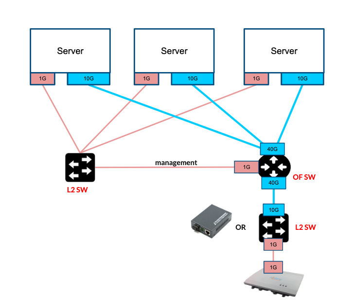
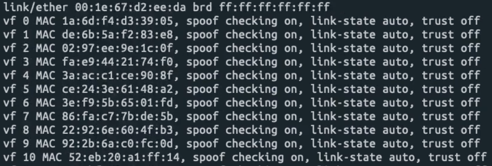
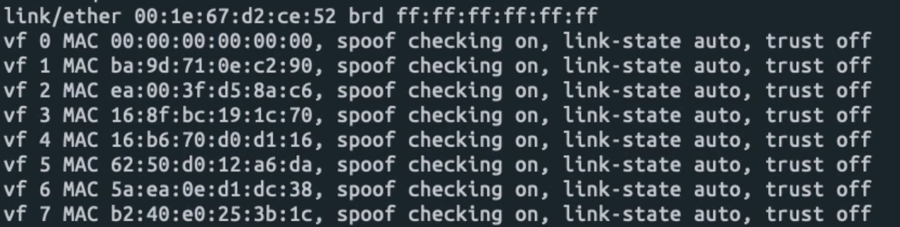

# Prerequisites

This page will introduce the pre-installation before installing OMEC, which includes:

* Hardware Requirements;
* Nodes Setup for COMAC;
* Install Kubernetes;
* Install CORD platform and COMAC profile;
* Setup Underlay Fabric.

The introduction is based on multi-cluster: Edge and Central. If you want to install single cluster, you can ignore the central part.

## Hardware Requirements

Based on the description of "Generic Hardware Guidelines" <https://guide.opencord.org/prereqs/hardware.html#generic-hardware-guidelines>, we are going to introduce the specific requirements for COMAC in this page.


* **Compute Machines**: Same as described in "Generic Hardware Guidelines" page. But you want to use multi-cluster COMAC, then you can prepare two same setups. Also, COMAC requires at least Intel XEON CPU with Haswell microarchitecture or better.

* **Network Cards**: For 3GPP data plane, COMAC supports high performance with SR-IOV interfaces. So besides the first 1G NIC for management, COMAC also need another 10G NIC on computer machines for user data traffic.

* **Access Devices**: In COMAC, the access devices here refer to Enodebs. The enodeb for this release we use Accelleran E1000. The rest of the hardware are same with "Hardware Requirements" section on "Generic Hardware Guidelines" page.

* **COMAC BOM Example**:

  One cluster with one OpenFlow switch setup example:



  3x x86 server (10G NIC)  
  1x OpenFlow switch (40G NIC)  
  1x DAC breakout cable  
  5x Ethernet copper cables  
  2x layer 2 switches, one is for management, another is as converter between 1G and 10G NICs


## Nodes Setup for COMAC

In this section, we need to prepare some COMAC specific work before install K8S.

* **OS requirement**

  COMAC runs on K8S, so any OS distribution should work, we tested Ubuntu 16.04 and 18.04 so far.

* **Download repos**

  Download automation-tools, configurations and the helm charts:

  ```shell
  git clone https://gerrit.opencord.org/automation-tools
  git clone https://gerrit.opencord.org/pod-configs
  git clone https://gerrit.opencord.org/helm-charts
  ```

* **SCTP Setup**

   The protocol for S1-MME interface is SCTP, but SCTP is not loaded by ubuntu OS by default. So we need to setup SCTP on all nodes:

  ```shell
  sudo modprobe nf_conntrack_proto_sctp
  echo ‘nf_conntrack_proto_sctp’ >> /etc/modules
  ```

  You can verify whether he sctp module is loaded by command:

  ```shell
  sudo lsmod | grep sctp
  ```

* **SR-IOV Setup**

   In this release, we pre-setup the SR-IOV support on the nodes which will run SPGWU and CDN containers.

   COMAC use “*VFIO driver*” for userspace APP with DPDK for SPGWU. To setup SR-IOV support on nodes, COMAC team provides a script inside automation-tools repo. This script will help you to setup the SR-IOV, including: check whether the hardware virtualization is enabled in BIOS, enable IOMMU, enable Hugepage, enable the SR-IOV, etc.

   So what you need to do is just run the following command lines on the node with SR-IOV supported NIC:

  ```shell
  git clone https://gerrit.opencord.org/automation-tools
  sudo automation-tools/comac/scripts/node-setup.sh <SR-IOV-supported-NIC-name>
  ```

  You can verify it with command:

  ```shell
 ip link show
  ```
   You should see the 63 VF interfaces in the result like this:

   

  COMAC use “*Netdevice driver*” for CDN. Run the following command on the node where you want to run CDN container:

  ```shell
 sudo su
 echo '8' > /sys/class/net/eth2/device/sriov_numvfs
  ```
 You can verify it with command:

  ```shell
# ip link show
  ```
  You should see the 8 VF interfaces in the result like this:

  

## Install Kubernetes

You can refer to the [Kubernetes page](https://guide.opencord.org/prereqs/kubernetes.html) for installation. In this section, we only describe the COMAC specific work.

As we described before, SCTP protocol is used on S1-MME interface between BBU and MME containers. To enable this feature, COMAC needs to enable the SCTP feature by adding the following line in "*inventory/comac/extra-vars.yaml*" file.

```shell
kube_feature_gates: [SCTPSupport=True]
```
In COMAC, most containers have multiple and different types of interfaces. Take the SPGWU container for example, one is used to talk to SPGWC for receiving police info and commands to setup GTP tunnels which does not need high performace, this interface is based on calico. The second and the third interfaces are S1U and SGI interfaces, which will run user traffic, those interfaces are based on SR-IOV.

[Multus](https://github.com/kubernetes-sigs/kubespray/blob/master/docs/multus.md) is a meta Container Network Interfaces (CNI) plugin that provides multiple network interface support to pods, which is needed by COMAC.

So in "*inventory/comac/extra-vars.yaml*" file, for the Container CNI plugins, COMAC needs to add the following lines:

```shell
kube_network_plugin: calico
kube_network_plugin_multus: true
multus_version: stable
```


## Install CORD Platform and COMAC Profile

* **Install CORD Platform**

```shell
 helm init --wait --client-only
 helm repo add incubator https://kubernetes-charts-incubator.storage.googleapis.com/
 helm repo add cord https://charts.opencord.org
 helm repo update
 helm install -n cord-platform cord/cord-platform --version 7.0.0 -f automation-tools/comac/sample/omec-override-values-multi.yaml
```

* **Install COMAC Profile**

```shell
 helm install -n comac-platform --version 0.0.6 cord/comac-platform --set mcord-setup.enabled=false --set etcd-cluster.enabled=false
```
## Fabric Configuration

You can refer to [Trellis Underlay Fabric](https://wiki.opencord.org/display/CORD/) for more info on how to config the fabric.

  You can modify the exmpale file "mcord-local-cluster-fabric-accelleran.yaml" according to your netowrk, and insert fabric configuration with command:

  ```shell
$ cd pod-configs/tosca-configs/mcord
curl -H "xos-username: admin@opencord.org" -H "xos-password: letmein" -X POST --data-binary @mcord-local-cluster-fabric-accelleran.yaml http://<cluster-ip>:30007/run

  ```


