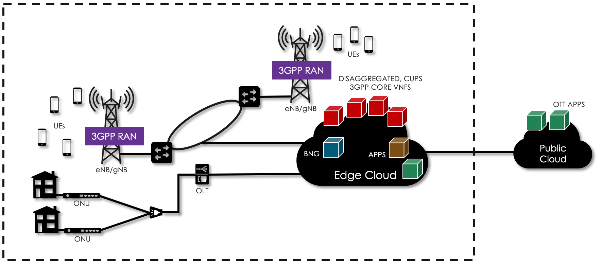
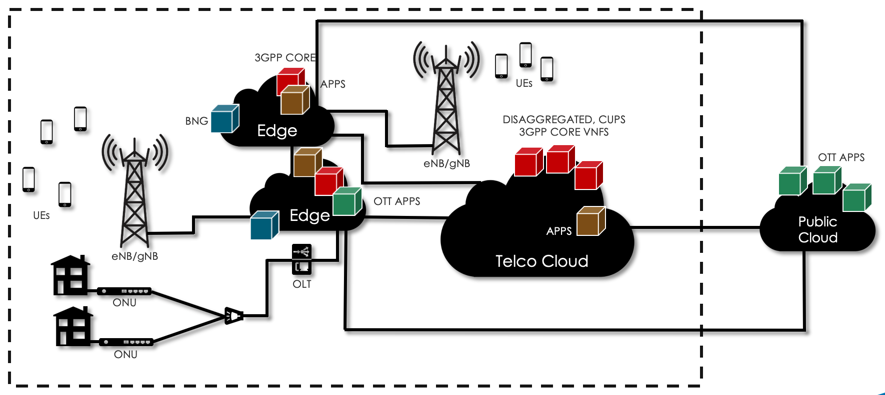
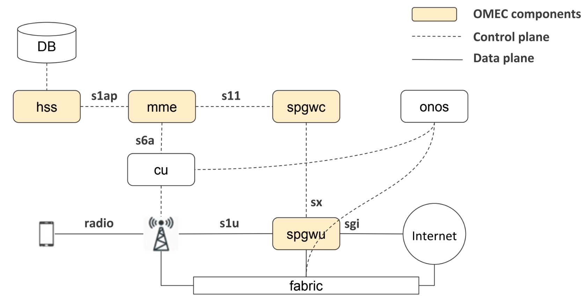

# Overview

## What is COMAC

COMAC is a reference design and a exemplar platform to bring convergence to operators' mobile and broadband access and core networks.

In the mobile access and core, the architecture allows service providers to disaggregate both Radio Access Network (RAN) and the core networks (EPC). Moreover, the architecture enables programmatic control of the RAN (through O-RAN/xRAN/ProgRAN), as well as core services chaining. In addition, the architecture can split into the control plane (e.g., CU/BBU, MME, HSS, SPGW-C) and the user plane (SPGW-U). After that, service providers locate the control plane on the central cluster, while the user plane is running on the edge cluster.

As for other profiles, the service management of both VNFs and SDN applications is orchestrated by XOS/NEM.

COMAC is a powerful platform that allows to rapidly innovate mobile networks. As such, it features 5G specific functionalities, such as split-RAN (C-RAN), RAN user plane and control plane separation (O-RAN/xRAN), and programmable RAN slicing (ProgRAN). These features have already been demonstrated.

The 3GPP cellular connectivity requires a number of core network components. The base station need to pass the UEs' traffic to the SPGW-U VNF through a fabric switch, e.g., an OpenFlow switch. 3GPP has its own control plane, which is responsible for mobility and session management, authentication, QuS policy enforcement, etc. For this reason, the eNB needs also connectivity to the MME VNF to exchange 3GPP control messages. The 3GPP control plane service graph also requires connectivity among the MME, the HSS, the HSS Database, the SPGW-C, and the SPGW-U VNFs. It's the SPGW-U VNF that carries the UE traffic out of the COMAC POD through fabric switch toward public cloud or external Packet Data Networks (PDNs).

COMAC ships with the basis (e.g., ONOS, XOS/NEM, Logging, Monitoring, Docker, Kubernetes) as well as a number of containerized EPC VNFs to support 5G mobile access networks. The EPC VNFs icnludes a Control User Plane Separation (CUPS) compliant open-source SPGW (in the form of two VNFs: SPGW-U and SPGW-C), as well as an MME, a HSS, and HSS Database. Of course, all EPC VNFs is open-source software. In order to connect real User Equipments (UEs) with EPC, both standalone eNodeB (eNB) hardware and C-RAN based RU hardware can be used.

The picture below shows a diagram representing a COMAC POD in a single-cluster environment.

As shown, COMAC provides connectivity for wireless UEs to the public cloud or Packet Data Networks (PDNs). The PDNs are service provider specific networks, such as VoLTE networks and public networks like Internet. Connectivity wise, at a high-level COMAC uses two networks: a RAN and a 3GPP Core. The RAN is composed of a number of base stations (eNB in LTE/gNB in 5G) that provide wireless connectivity to UE while they move. The base stations are COMAC peripherals, which support both non-disaggregated and split C-RAN architecture. Both types of base stations should be connected to the COMAC POD through a fabric switch managed by a SDN controller (e.g., ONOS). In case of a C-RAN solution, the base station are split into two components: a Distributed Unit (DU) and a Centralized Unit (CU). the CU is virtualized and implemented as a containerized VNF running on the edge cloud. In addition, COMAC POD supports broadband access networks by using ONU, OLT, and BNG devices.

Also, a COMAC POD can be running in a multi-cluster environment.

According to the figure, there are three types of Clouds: (i) Edge cloud; (ii) Telco central cloud; (iii) Public cloud. Of course, the edge cloud has the shortest distance to UEs unlike the public cloud which has the longest distance to UEs. In this multi-cluster environment, service providers locates the user plane, i.e., SPGW-U and some of OTT application on the Edge cloud, which is possible to reduce the data traffic latency. On the contrary, the control plane (e.g., MME, HSS, HSS-DB, etc) can be operating on the Telco central cloud for efficient network/cloud management.

*NOTE: This COMAC release only supports 4G mobile network; the broadband access networks will be included in the future COMAC release.*

## Glossary

> EXPERTS! Maybe we’re saying something obvious here, but we want to make sure we’ve a common understanding on the basic terminology, before going through the rest of the guide. If you already know all this, just skip this section.

Following is a list of basic terms used in COMAC.

* **Base Station**: a radio transceiver of a wireless communications station.
* **eNodeB (Evolved Node B)**: The base station used in 4G/LTE networks.
* **EPC (Evolved Packet Core)**: it’s the core network of an LTE system. It allows user mobility, wireless data connections, routing, and authentication
* **HSS (Home Subscriber Server)**: a central database that contains user-related and subscription-related information interacting with the MME.
* **MME (Mobility Management Entity)**: it’s the key control node used in LTE access networks. An MME provides mobility management, session establishment, and authentication.
* **RAN (Radio Access Network)**: it describes a technology, a set of devices, to connect UEs to other parts of a network through radio connections
* **SPGW-C (Serving Gateway and PDN Gateway Control plane)**: a control plane node, responsible for signaling termination, IP address allocation, maintaining UE’s contexts, charging.
* **SPGW-U (Serving Gateway and PDN Gateway User plane)**: a user plane node connecting the EPC to the external IP networks and to non-3GPP services
* **UE (User Equipment)**: any device used directly by an end-user to communicate to the base station, for example a cell phone.

## System overview

The current release of COMAC includes:

* An open source EPC, providing an SPGW control plane, an SPGW user plane, an MME, an HSS, an HSS_DB and RAN emulator (OpenAirInterface).
* Allow service providers to use not only single-cluster environment but also multi-cluster environment which includes the edge cluster for the user plane and the Telco central cluster for the control plane.
* Real standalone eNB, C-RAN eNB, and UEs can be used. The eNB should be physically connected to a fabric switch in COMAC POD where SPGW-U is running.
* An open-source Contents Delivery Network (CDN) to play video streams on UEs. It generates the realistic traffic load rather than network tools typically we have been used such as ping and iPerf.

See release note to know COMAC release information in detail.

## EPC in COMAC: Open Mobile Evolved Core (OMEC)

The EPC shipped with COMAC is called "Open Mobile Evolved Core (OMEC)." It is provided as an open-source reference implementation. In the current release, it includes "Next Generation Infrastructure Core (NGIC)", "Clean CUPS Core for Packet Optimization (C3PO)", and OpenMME.

In this release, NGIC includes two services implemented in separate containers: the SPGW-C and the SPGW-U containers. the SPGW-C and SPGW-U are the Control User Plane Separation (CUPS) implementation of the conventional SAE-GW (i.e., S-GW and P-GW) which deals with converged voice and data services as 5G networks. The NGIC CUPS architecture is aligned with the 3GPP 5G direction. It has been developed using Data Plane Development Kit (DPDK) version as well as SR-IOV optimized for Intel Architecture.

C3PO includes two services implemented in separate containers, HSS and HSS Database, as an open-source reference implementations. In addition, OpenMME is a service implemented in a container.

If you interested to know more and explore the EPC codes, please see [here](https://github.com/omec-project)
