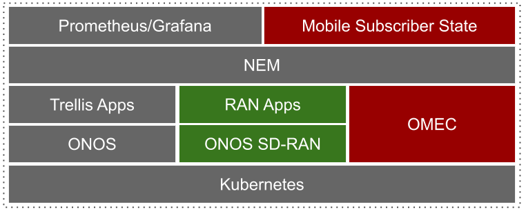

# COMAC v1.0.0 Release Note

This is the first major release of [COMAC (Converged Multi-Access and Core)](https://www.opennetworking.org/comac/).

### Software achitecture

All components of COMAC runs on Kubernetes. The release includes Helm charts for deploying
[OMEC](https://github.com/omec-project), COMAC profile, and an example application CDN.
SDN based RAN in green boxes will not be part of v1.0.0 but subsequent releases.

### Highlights

* Support open source EPC, [OMEC](https://github.com/omec-project).
* Support both centralized and distribued scenario where control plane components of EPC are placed in a central cloud and data plane components are placed in edges.
* Support SR-IOV and DPDK for accelerating the data plane.
* Support an emulated development environment [COMAC-in-a-box](https://guide.opencord.org/profiles/comac/install/ciab.html).
* Provide mobile subscriber state monitoring.
* Provide sample Grafana dashboard setting.
* Provide an example application, CDN.
* Leverage the latest v7.0 CORD-Platform for basic node and K8S pod monitoring and logging.
* Leverage [Trellis](https://docs.trellisfabric.org/) for underlay fabric.

