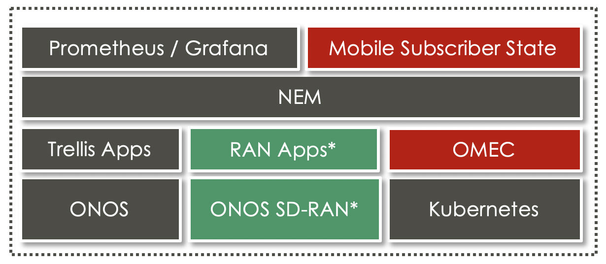

# COMAC Release Note

This is the first release of [COMAC (Converged Multi-Access and Core)](https://www.opennetworking.org/comac/). 
After many years work, this project is graduating from demo quality to field trial quality towards production readiness.

Release v1.0 achitecture overview:

Highlights:

* Comac supports both single cluster and multi-cluster.
* Comac supports running on both full pod and [COMAC-in-a-box](https://guide.opencord.org/profiles/comac/install/ciab.html).
* The EPC of COMAC is [OMEC](https://github.com/omec-project).
* COMAC added a new feature: Mobile Subscriber State.
* COMAC also has it own Grafana dashboard for monitoring.
* COMAC leverages the latest v7.0 CORD-Platform.
* COMAC is based on Kubernetes and containers, no VMs.
* The underlay fabric is based on [Trellis](https://docs.trellisfabric.org/).
* The RAN part in green boxes will not be part of v1.0 release, but subsequent releases.

Also for supportting video streaming in COMAC:

* COMAC team created an open source CDN service in this release.

