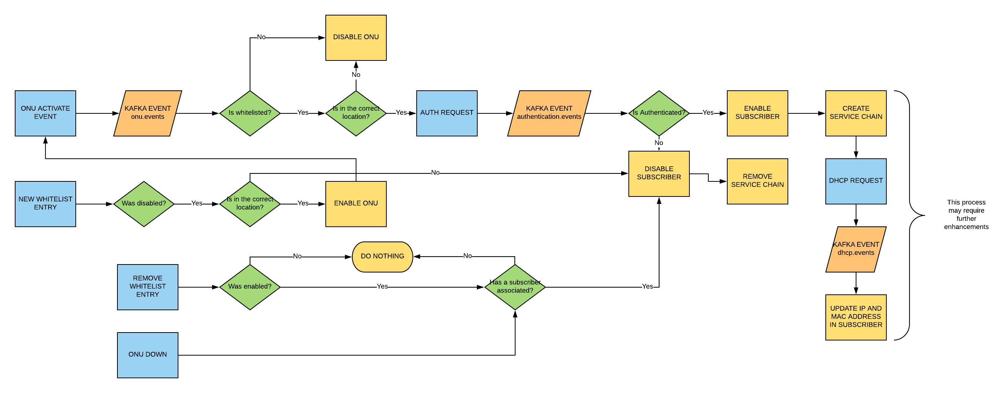

# AT&T Workflow

You can find a complete description of the SEBA workflow for At&t in [this document](https://docs.google.com/document/d/1nou2c8AsRzhaDJmA_eYvFgd0Y33KiCsioveU77AOVCI/edit#heading=h.x73smxj2xaib). This pages focus exclusively on the internals details of the workflow such as actions triggered by the environment and decisions taken by NEM.

## Helm charts

To replicate this workflow you'll need to install:

- [xos-core](../../../charts/xos-core.md)
- [cord-kafka](../../../charts/kafka.md)
- [voltha-kafka](../../../charts/voltha.md)
- [voltha](../../../charts/voltha.md)
- [onos-voltha](../../../charts/onos.md#onos-voltha)
- [onos-fabric](../../../charts/onos.md#onos-fabric)
- att-workflow

### Install the `att-workflow` chart

```shell
helm dep update xos-profiles/att-workflow
helm install -n att-workflow xos-profiles/att-workflow
```

## Workflow description

1. ONT discovered bottom-up
2. If ONT serial number is not allowed or unknown (i.e it has NOT been provisioned by OSS), disable the ONT; generate an event to external OSS that an ONU has been discovered but not yet provisioned.
3. When OSS provisions the ONT, re-enable it & program 802.1x flow - UNI port(s) will be UP
4. Ensure that DHCP fails here (because subscriber/service-binding has not been provisioned by OSS yet)
5. 802.1x EAPOL message happens from RG, and ONOS AAA app adds options and sends to radius server. Options are pulled from Sadis/NEM  - no subscriber information is required here
6. If RG authentication fails, allow it to keep trying (in the future consider redirection to captive / self-help portal). DHCP should not succeed since RG authentication has failed
7. If RG authentication succeeds, ONOS AAA app notifies via an event on the kafka bus that authentication has succeeded
8. NEM can listen for the event, and then check to see if subscriber/service-binding has happened on that port from OSS - if not, then nothing to be done
9. Must ensure that DHCP fails here even though RG has been authenticated (because subscriber/service-binding has not been provisioned by OSS yet)
10. When OSS provisions the subscriber/service-binding on the UNI port and gives the C and S vlan info, then DHCP trap will be programmed on the port, and DHCP process can start
11. If RG is disconnected from UNI port, force authentication again (even if subscriber/service-binding has been provisioned by OSS). Upon reconnection  to UNI port, RG must re-authenticate before DHCP/other-traffic can flow on the provisioned VLANs.
12. DHCP L2 relay -> add option 82, learn public IP address, forward via dataplane to external DHCP server


This schema summarizes the workflow, please note:

- in `light blue` are environment events (wether they are triggered from hardware or from an operator)
- in `yellow` are NEM configuration calls to ONOS or VOLTHA
- in `green` are decisions
- in `orange` event published on the kafka bus



> NOTE: when we refer to `service chain` we are talking about the set of
subscriber specific service instances that will trigger the `add_subscriber`
call in ONOS-VOLTHA and provision the crossconnect in ONOS-FABRIC

## Operations

We assume your POD is already configured as per[this instructions](../configuration.md)
(you need to complete only the first section)

### Whitelist population

To configure the ONU whitelist, you can use this TOSCA:

```yaml
tosca_definitions_version: tosca_simple_yaml_1_0
imports:
  - custom_types/attworkflowdriverwhitelistentry.yaml
  - custom_types/attworkflowdriverservice.yaml
description: Create an entry in the whitelist
topology_template:
  node_templates:

    service#att:
      type: tosca.nodes.AttWorkflowDriverService
      properties:
        name: att-workflow-driver
        must-exist: true

    whitelist:
      type: tosca.nodes.AttWorkflowDriverWhiteListEntry
      properties:
        serial_number: BRCM22222222
        pon_port_id: 536870912
        device_id: of:000000000a5a0072
      requirements:
        - owner:
            node: service#att
            relationship: tosca.relationships.BelongsToOne
```

For instructions on how to push TOSCA into a CORD POD, please
refer to this [guide](../../../xos-tosca/README.md).

### Pre-provision subscribers

You can `pre-provision` subscribers using this TOSCA:

```yaml
tosca_definitions_version: tosca_simple_yaml_1_0
imports:
  - custom_types/rcordsubscriber.yaml

description: Pre-provsion a subscriber

topology_template:
  node_templates:

    # Pre-provision the subscriber the subscriber
    my_house:
      type: tosca.nodes.RCORDSubscriber
      properties:
        name: My House
        status: pre-provisioned
        c_tag: 111
        onu_device: BRCM22222222
        nas_port_id : "PON 1/1/03/1:1.1.1"
        circuit_id: foo
```

For instructions on how to push TOSCA into a CORD POD, please
refer to this [guide](../../../xos-tosca/README.md).

### OLT Activation

Once the system knows about whitelisted ONUs and subscribers,
you can activate the OLT:

```yaml
tosca_definitions_version: tosca_simple_yaml_1_0
imports:
  - custom_types/oltdevice.yaml
  - custom_types/voltservice.yaml
description: Create a simulated OLT Device in VOLTHA
topology_template:
  node_templates:

    service#volt:
      type: tosca.nodes.VOLTService
      properties:
        name: volt
        must-exist: true

    olt_device:
      type: tosca.nodes.OLTDevice
      properties:
        name: ONF OLT
        device_type: openolt
        host: 10.90.0.114
        port: 9191
        switch_datapath_id: of:0000000000000001
        switch_port: "1"
        outer_tpid: "0x8100"
        uplink: "128"
      requirements:
        - volt_service:
            node: service#volt
            relationship: tosca.relationships.BelongsToOne
```

For instructions on how to push TOSCA into a CORD POD, please
refer to this [guide](../../../xos-tosca/README.md).