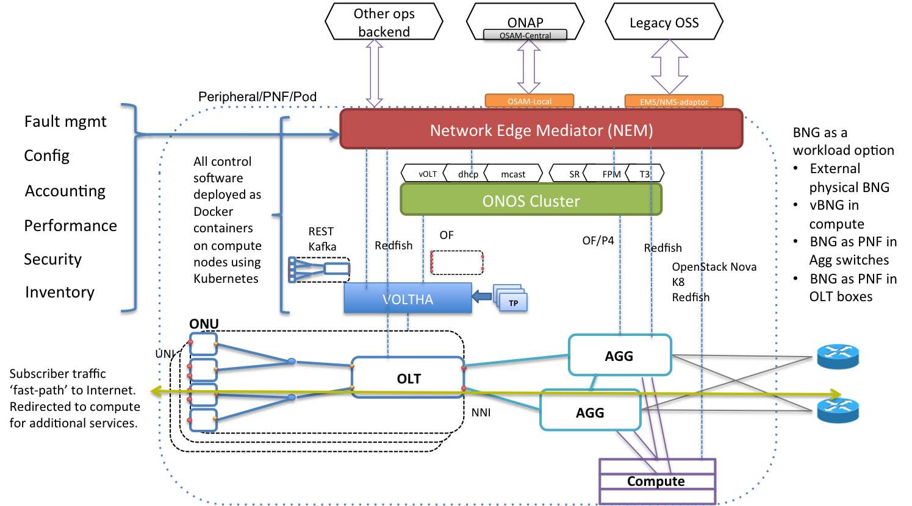

# SEBA Profile

SEBA (SDN Enabled Broadband Access) is a profile meant for residential access networks.

The following pages describe how to install SEBA with an operator defined workflow,
and how to configure, operate and troubleshoot an installed SEBA POD.

For more information on the SEBA community visit the [SEBA wiki page](https://wiki.opencord.org/display/CORD/SEBA)
