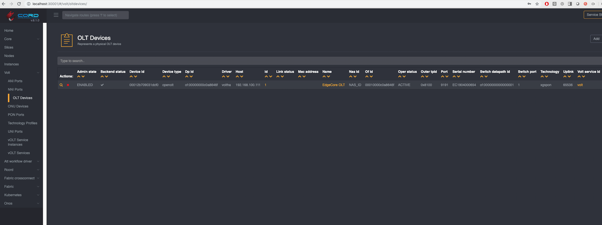
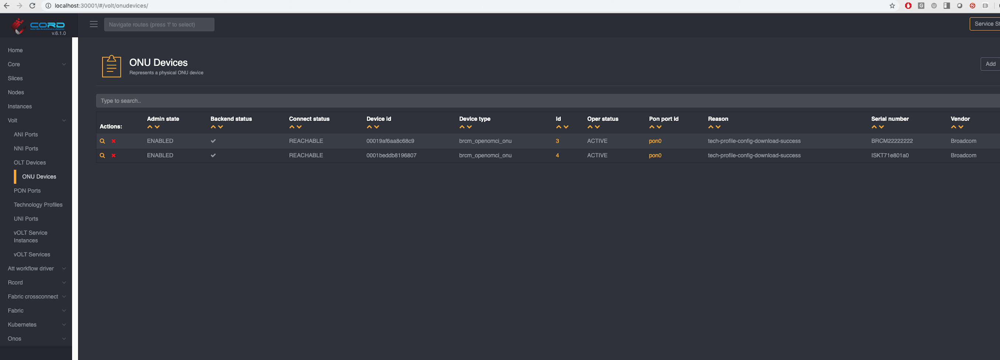

# OLT Provisioning

OLT Provisioning consists of specifying the fields shown below to instruct NEM about the serial number of the OLT, and where it can be reached in the management network.
As soon as this config is pushed, NEM will load VOLTHA's etcd with the technology profile, and make the 'preprovision' and 'enable' calls to VOLTHA with the OLT information.

## Provision the OLT

OLT provisioning can use the same yaml file where the Technology profile is configured.
For clarity it is shown separately below.

Note the following when provisioning an OLT:

* It is really important to get the serial number of the OLT correct
* You need to specify the IP address and TCP port where the OLT can be reached by VOLTHA on the management network (out-of-band)
* In a SEBA pod, the OLT connects upstream to an AGG switch that is SDN controlled just like the OLT. We need to specify the NNI port on the OLT, the AGG switch port to which the NNI port is connected, and the OF switch datapath id (dpid) for the AGG switch as seen by ONOS.
* OLTs can typically use tag-protocol ids 0x88a8 or 0x8100 for the outer vlan tag in a QinQ packet. We use 0x8100.


Learn more about the OLT service [here](../../../olt-service/README.md)


```yaml
tosca_definitions_version: tosca_simple_yaml_1_0
imports:
  - custom_types/oltdevice.yaml
  - custom_types/onudevice.yaml
  - custom_types/voltservice.yaml
  - custom_types/technologyprofile.yaml
description: Create an OLT Device in VOLTHA
topology_template:
  node_templates:

    service#volt:
      type: tosca.nodes.VOLTService
      properties:
        name: volt
        must-exist: true

    olt_device:
      type: tosca.nodes.OLTDevice
      properties:
        name: My OLT
        device_type: openolt
        host: 10.90.0.122 # the IP address where the OLT can be reached on the management network
        port: 9191 # the TCP port on which the OLT is listening for VOLTHA to connect to it
        switch_datapath_id: of:0000000000000001 # the openflow id of the AGG switch to which the OLT is connected
        switch_port: "1" # the port on the AGG switch to which the OLT is connected
        outer_tpid: "0x8100"
        uplink: "65536" # the NNI port on the OLT, used to connect to the AGG switch
        nas_id: "NAS_ID"
        serial_number: EC1721000208 # the serial number of the OLT device
      requirements:
        - volt_service:
            node: service#volt
            relationship: tosca.relationships.BelongsToOne
```

## Verify OLT

On the NEM GUI, confirm that the OLT has been added to the XOS database.



## Verify ONUs

VOLTHA should have reached out to the OLT and discovered ONUs and started OMCI messaging on the PON. If all is well, you should see the information shown below in the ONU tab.

Note the following expected states:

* Admin state: ENABLED (if this is disabled, it is possible that the ONU serial number and location configured on the whitelist is incorrect or missing)
* Connect state: REACHABLE
* Operational state: ACTIVE
* OMCI state (titled `Reason`): tech_profile_config_download_success

 This is the same information displayed by the `devices` command on the VOLTHA CLI.



## Next Steps

OLT provisioning is typically the last step of provisioning, although you can continue to add ONUs to the whitelist and/or add new subscriber information.

You are now ready to [operate the POD](../operate/att-si.md).
