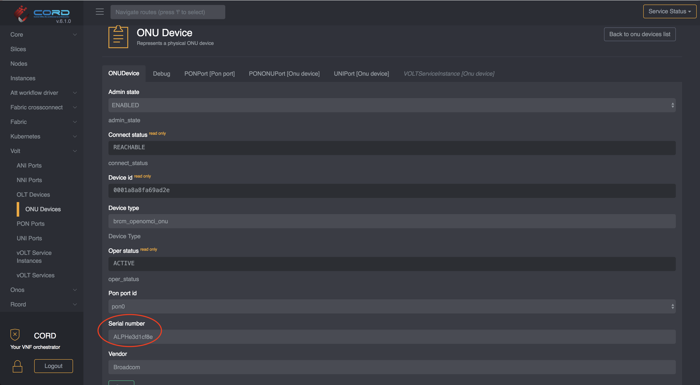

# Configure ONU Whitelist

We assume your POD is already configured as per [these instructions](../configuration.md)
Assuming you are using the AT&T Workflow (which is the only workflow supported in this release) you will need to configure ONUs in the whitelist, otherwise any ONU discovered in the PON that is not in the whitelist will get disabled administratively.

## Whitelist population

> NOTE: the whitelist can be populated at any time.
> It doesn't need to be done upfront.

To configure the whitelist, you need to provide the ONU's serial number and location.
The location is identified by the OLT device, and the PON port on the OLT device on which the ONU can be found.
If either of these are configured incorrectly, the ONU will get disabled administratively.

To configure the ONU whitelist, you can use this TOSCA:

```yaml
tosca_definitions_version: tosca_simple_yaml_1_0
imports:
  - custom_types/attworkflowdriverwhitelistentry.yaml
  - custom_types/attworkflowdriverservice.yaml
description: Create an entry in the whitelist
topology_template:
  node_templates:

    service#att:
      type: tosca.nodes.AttWorkflowDriverService
      properties:
        name: att-workflow-driver
        must-exist: true

    whitelist:
      type: tosca.nodes.AttWorkflowDriverWhiteListEntry
      properties:
        serial_number: BRCM22222222 # the serial number of the ONU device
        pon_port_id: 536870912 # information in VOLTHA regarding the PON port of the OLT
        device_id: of:000000000a5a0072 # the device id representing the OLT
      requirements:
        - owner:
            node: service#att
            relationship: tosca.relationships.BelongsToOne
```

For instructions on how to push TOSCA into a CORD POD, please
refer to this [guide](../../../xos-tosca/README.md).

### Where to find the required information

#### Serial Number

To locate the ONU serial number you can open the ONU detail view (`vOLT -> ONU Devices`).



> NOTE: most of the time the serial number is also printed on the physical device.

#### Pon Port ID

The `pon_port_id` can be found from the ONU detail view, by selecting the `PON Port`
tab:


#### Device ID

The `device_id` can easily be found in the OLT list view. Note the `device_id` is
the openflow ID of the logical device exposed to ONOS, and not the serial number
of the device.


