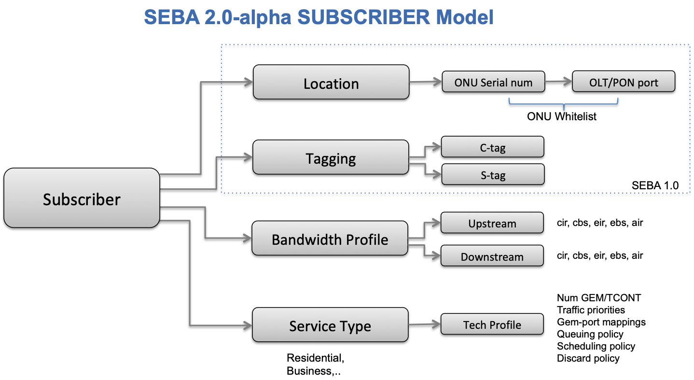
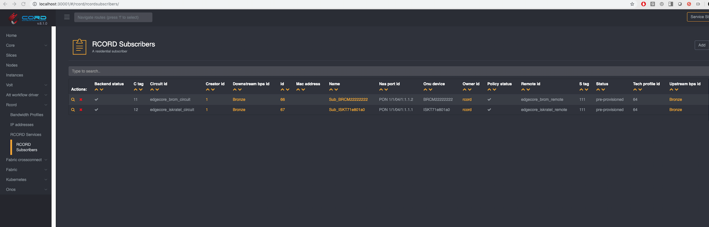
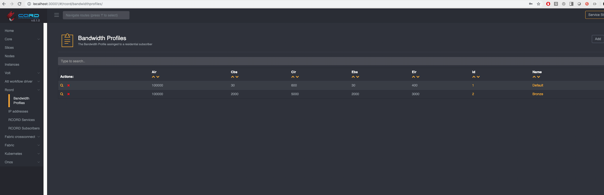

# Subscriber Provisioning

Once the POD has been configured, you can create a subscriber. As before, a subscriber must be configured by location (ONU) and identification (VLAN tagging) information.
From SEBA 2.0 onwards, it is necessary to provide a BandwidthProfile for the subscriber in both upstream and downstream directions.
It is also necessary to provide a Technology Profile id for the subscriber.
Learn more about Subscriber provisioning [in this video](https://www.youtube.com/watch?v=RXjH9zdjqvA&t=420s)



This section will guide you through the configuration of `Subscriber` and associated `BandwidthProfile`s.

## Provision a Subscriber

Once you have the required information, you can create the subscriber by
customizing the following TOSCA and passing it into the POD.

A few things to note:

* It is important to configure a Default bandwidthprofile, along with the subscriber's own bandwidthprofile
* As before the C and S tags together should uniquely identify the subscribers
* The ONU serial number to which the subscriber's equipment (Remote Gateway) connects must be specified
* The tech_profile_id (representing the type of service) for the subscriber should also be specified. It is not necessary to have the tech profile already configured at the time of subscriber provisioning; i.e. the tech profile can come later but should have the same id. Also please note that in this release, it is not possible to change the tech profile id for a subscriber, as this functionality has not been implemented in VOLTHA.
* The subscriber should be provisioned in 'pre-provisioned' state to allow the workflow to determine when to program subscriber flows in the hardware (for example, after successful RG authentication)


```yaml
tosca_definitions_version: tosca_simple_yaml_1_0
imports:
  - custom_types/rcordsubscriber.yaml
  - custom_types/bandwidthprofile.yaml

description: Pre-provsion subscribers

topology_template:
  node_templates:

    default:
      type: tosca.nodes.BandwidthProfile
      properties:
        name: Default # used before subscriber's equipment has been authenticated
        air: 100000
        cbs: 30
        cir: 600
        ebs: 30
        eir: 400

    high_speed_bp:
      type: tosca.nodes.BandwidthProfile
      properties:
         name: Bronze
         air: 100000
         cbs: 2000
         cir: 5000
         ebs: 2000
         eir: 3000

    # A subscriber
    h1_subscriber:
      type: tosca.nodes.RCORDSubscriber
      properties:
        name: Sub_ISKT71e801a0
        status: pre-provisioned # Add the subscriber in pre-provisioned state
        c_tag: 12
        s_tag: 111
        onu_device: ISKT71e801a0 # Serial Number of the ONU Device to which this subscriber is connected
        nas_port_id : "PON 1/1/04/1:1.1.1" # radius specific attributes
        circuit_id: edgecore_iskratel_circuit # radius specific attributes
        remote_id: edgecore_iskratel_remote # radius specific attributes
        tech_profile_id: 64 # The ID of the technology profile that needs to be applied to this subscriber
      requirements:
       - upstream_bps:
           node: high_speed_bp
           relationship: tosca.relationships.BelongsToOne
       - downstream_bps:
           node: high_speed_bp
           relationship: tosca.relationships.BelongsToOne

    # Another subscriber
    h2_subscriber:
      type: tosca.nodes.RCORDSubscriber
      properties:
        name: Sub_BRCM22222222 # give a different name
        status: pre-provisioned
        c_tag: 11  # the combination of stag and ctag must
        s_tag: 111 # uniquely identify a subscriber
        onu_device: BRCM22222222 # different ONU serial number (location)
        nas_port_id : "PON 1/1/04/1:1.1.2"
        circuit_id: edgecore_brcm_circuit
        remote_id: edgecore_brcm_remote
        tech_profile_id: 64
      requirements:
       - upstream_bps:
           node: high_speed_bp # could have same or different bandwidth profile
           relationship: tosca.relationships.BelongsToOne
       - downstream_bps:
           node: high_speed_bp
           relationship: tosca.relationships.BelongsToOne
```

For instructions on how to push TOSCA into a CORD POD, please
refer to this [guide](../../../xos-tosca/README.md).

## Confirm Subscriber

On the NEM GUI, confirm that the subscriber has been added.



Also confirm that bandwidth profiles have been added



## Find ONU Serial Number

In production, an operator should already know all the information regarding the subscriber's location - ie the ONU to which the subscriber connects and the serial number of the ONU.
In a lab setting you may need to bring up the system once to note down the serial numbers.

Once your POD is set up and the OLT has been pushed and activated in VOLTHA,
NEM will discover the ONUs available in the system.

You can find the ONUs and their serial numbers through:

* XOS GUI: on the left side click on `vOLT > ONUDevices`
* XOS Rest API: `http://<pod-id>:<chameleon-port|30006>/xosapi/v1/volt/onudevices`
* VOLTHA CLI: [Command Line Interface](../../../charts/voltha.md#how-to-access-the-voltha-cli)

If you are connected to the VOLTHA CLI you can use the following
command to list all the existing devices:

```shell
(voltha) devices
Devices:
+------------------+-------------------+------+------------------+---------------+-------------+-------------+----------------+----------------+----------------------+--------------------------------------+-------------------------+----------------------+------------------------------+
|               id |              type | root |        parent_id | serial_number | admin_state | oper_status | connect_status | parent_port_no |        host_and_port |                               reason | proxy_address.device_id | proxy_address.onu_id | proxy_address.onu_session_id |
+------------------+-------------------+------+------------------+---------------+-------------+-------------+----------------+----------------+----------------------+--------------------------------------+-------------------------+----------------------+------------------------------+
| 00010c6fb4ae4011 |           openolt | True | 00010000c0a8646f |  EC1904000654 |     ENABLED |      ACTIVE |      REACHABLE |                | 192.168.100.111:9191 |                                      |                         |                      |                              |
| 00019af6aa8c68c9 | brcm_openomci_onu |      | 00010c6fb4ae4011 |  BRCM22222222 |     ENABLED |      ACTIVE |      REACHABLE |      536870912 |                      | tech-profile-config-download-success |        00010c6fb4ae4011 |                    1 |                            1 |
| 0001beddb8196807 | brcm_openomci_onu |      | 00010c6fb4ae4011 |  ISKT71e801a0 |     ENABLED |      ACTIVE |      REACHABLE |      536870912 |                      | tech-profile-config-download-success |        00010c6fb4ae4011 |                    2 |                            2 |
+------------------+-------------------+------+------------------+---------------+-------------+-------------+----------------+----------------+----------------------+--------------------------------------+-------------------------+----------------------+------------------------------+

```

Locate the correct ONU and note that the display above readily shows the serial number of the ONU as well as the PON port number on the OLT to which it connects (`parent_port_no`). You can also enter the particular device cli to display more information as shown below.

```shell
(voltha) device 00019af6aa8c68c9
(device 00019af6aa8c68c9) show
Device 00019af6aa8c68c9
+------------------------------+--------------------------------------+
|                        field |                                value |
+------------------------------+--------------------------------------+
|                           id |                     00019af6aa8c68c9 |
|                         type |                    brcm_openomci_onu |
|                    parent_id |                     00010c6fb4ae4011 |
|                       vendor |                             Broadcom |
|                serial_number |                         BRCM22222222 |
|                      adapter |                    brcm_openomci_onu |
|                  admin_state |                                    3 |
|                  oper_status |                                    4 |
|               connect_status |                                    2 |
|      proxy_address.device_id |                     00010c6fb4ae4011 |
+------------------------------+--------------------------------------+
|         proxy_address.onu_id |                                    1 |
| proxy_address.onu_session_id |                                    1 |
|               parent_port_no |                            536870912 |
|                       reason | tech-profile-config-download-success |
|                    vendor_id |                                 BRCM |
|                        ports |                            2 item(s) |
|                  flows.items |                            3 item(s) |
|                pm_configs.id |                     00019af6aa8c68c9 |
|      pm_configs.default_freq |                                  600 |
|           pm_configs.grouped |                                 True |
+------------------------------+--------------------------------------+
|            pm_configs.groups |                           11 item(s) |
+------------------------------+--------------------------------------+
```
