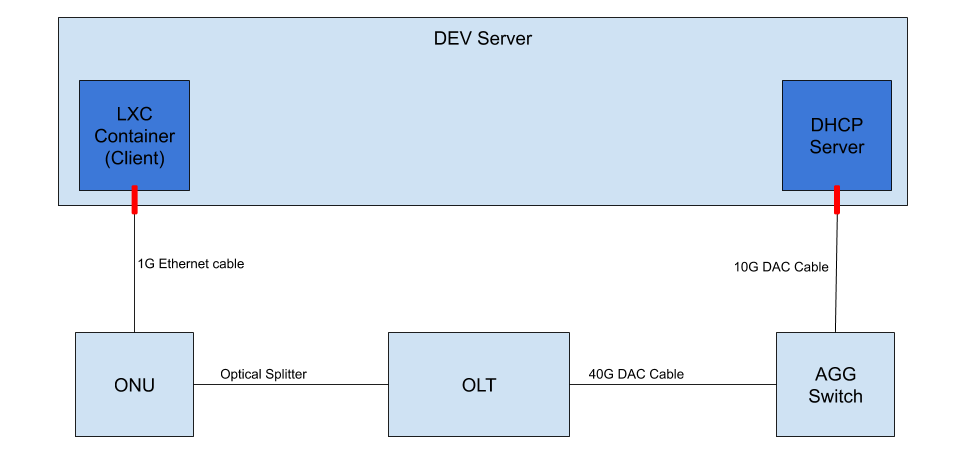

# Configuring a lab setup

This document is not strictly related to SEBA, but will be helpful in the case you are trying to
setup a POD in you lab.

## Overview

In a LAB setup you won't (most likely) use either a real RG or a real BNG, but they are not
strictly needed to test a SEBA pod as:

- the `RG` can be emulated by an `lxc` container (from now on `client`)
- the `BNG` can be emulated by an ubuntu server



_The image above represents the data plane connections in a LAB setup. It does not include the kubernetes cluster for simplicity._

What you'll need to emulate E2E traffic is:

- 1 x86 server with Ubuntu 16.04 and (at least):
    - 1 1G ethernet port
    - 1 10G ethernet port (this can be a second 1G interface as long as you have a media converter)

## Setting up a client

The first thing you need to do is to install `lxd` on your server. To do that you can follow
this guide: [http://tutorials.ubuntu.com/tutorial/tutorial-setting-up-lxd-1604](http://tutorials.ubuntu.com/tutorial/tutorial-setting-up-lxd-1604)

Once `lxd` is successfully installed you can create a container using these commands:

```bash
lxc launch ubuntu:16.04 <name>
lxc config device add <name> eth1 nic name=eth1 parent=<physical-intf> nictype=physical
```

where:

- `name` is the desired container name, internally we use the ONU serial number as name
- `physical-intf` is the name of the interface to which the ONU is physically connected

Once the container is running you need to enter it and do some configuration.

To access the container you can use the `lxc exec <name> bash` command.

Once inside:

```bash
# activate the interface
ip link set eth1 up
# install the wpasupplicant tool
apt update
apt install wpasupplicant
```

> NOTE `wpasupplicant` is a linux tool to perform 802.1X authentication. More informations [here](https://help.ubuntu.com/community/WifiDocs/WPAHowTo)

Create a configuration file for `wpasupplicant` in `/etc/wpa_supplicant/wpa_supplicant.conf` with the content:

```text
ctrl_interface=/var/run/wpa_supplicant
eapol_version=1
ap_scan=0
fast_reauth=1
network={
        key_mgmt=WPA-EAP
        eap=MD5
        identity="user"
        password="password"
        ca_cert="/etc/cert/cacert.pem"
        client_cert="/etc/cert/client.pem"
        private_key="/etc/cert/client.key"
        private_key_passwd="whatever"
        eapol_flags=3
} 
```

> NOTE that the configuration in this file is not really important if you are using the `freeradius` server provided
> as part of the SEBA helm charts. Do not worry if the certificates do not exist, they won't affect authentication as
> that is password based.

At this point you'll be able kickoff the authentication process (by sending `EAPOL` packets into the system) with the command:

```bash
wpa_supplicant -i eth1 -Dwired -c /etc/wpa_supplicant/wpa_supplicant.conf
```

If everything has been set up correctly, you should see something similar in the VOLTHA logs:

```bash
cord@node1:~$ kubectl logs -f -n voltha vcore-0 | grep -E "packet_indication|packet-in" | grep 888e
20180912T003237.453 DEBUG    MainThread adapter_agent.send_packet_in {adapter_name: openolt, logical_port_no: 16, logical_device_id: 000100000a5a0097, packet: 0180c200000390e2ba82fa8281000ffb888e01000009020100090175736572000000000000000000000000000000000000000000000000000000000000000000, event: send-packet-in, instance_id: compose_voltha_1_1536712228, vcore_id: 0001}
```

## Setting up the emulated BNG

The emulated BNG needs to perform only two operations: `DHCP` and `NAT`.

To setup a NAT router on an Ubuntu 16.04 server you can look at this tutorial: [https://www.nairabytes.net/81-linux/418-how-to-set-up-a-nat-router-on-ubuntu-server-16-04](https://www.nairabytes.net/81-linux/418-how-to-set-up-a-nat-router-on-ubuntu-server-16-04)

To install a DHCP server you can follow this tutorial: [http://nairabytes.net/81-linux/415-how-to-install-a-dhcp-server-in-ubuntu-server-16-04](http://nairabytes.net/81-linux/415-how-to-install-a-dhcp-server-in-ubuntu-server-16-04)

Once the `DHCP` server is installed, you need to configure it.

### Create Q-in-Q interfaces

On the interface that connects to the Agg Switch you are going to receive double tagged traffic,
so you'll need to create interfaces to received it.

Supposing that your subscriber is using `s_tag=111`, `c_tag=222` and the interface name is `eth2`
you can use this commands to create it:

```bash
ip link add link eth2 name eth2.111 type vlan id 111
ip link set eth2.111 up
ip link add link eth2.111 name eth2.111.222 type vlan id 222
ip link set eth2.111.222 up
ip addr add 10.11.2.254/24 dev eth2.111.222
```
Then you'll need to tell the `dhcp` server to listen on that interface, you can do that by editing
the file `/etc/default/isc-dhcp-server` so that it looks like:

```bash
INTERFACES="eth2.111.222"
```

> NOTE that you can list multiple interfaces, separated by spaces, in case you have multiple subscribers in your setup

In the `/etc/dhcp/dhcpd.conf` config file, configure the ip address range to assing to the double tagged interface
we created:

```text
subnet 10.11.2.0 netmask 255.255.255.0 {
  range 10.11.2.1 10.11.2.100;
  option routers 10.11.2.254;
  option domain-name-servers 8.8.8.8;
}
```

