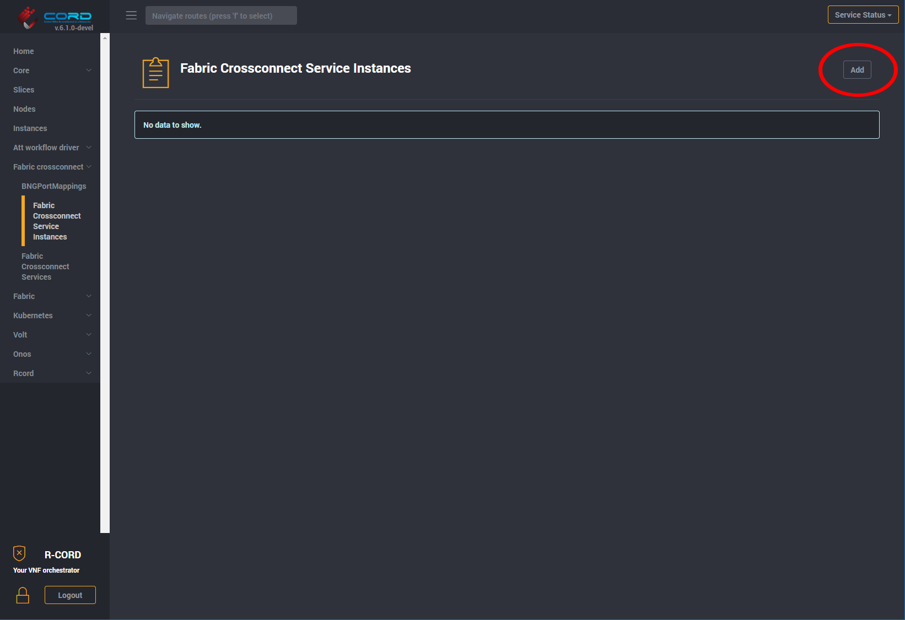
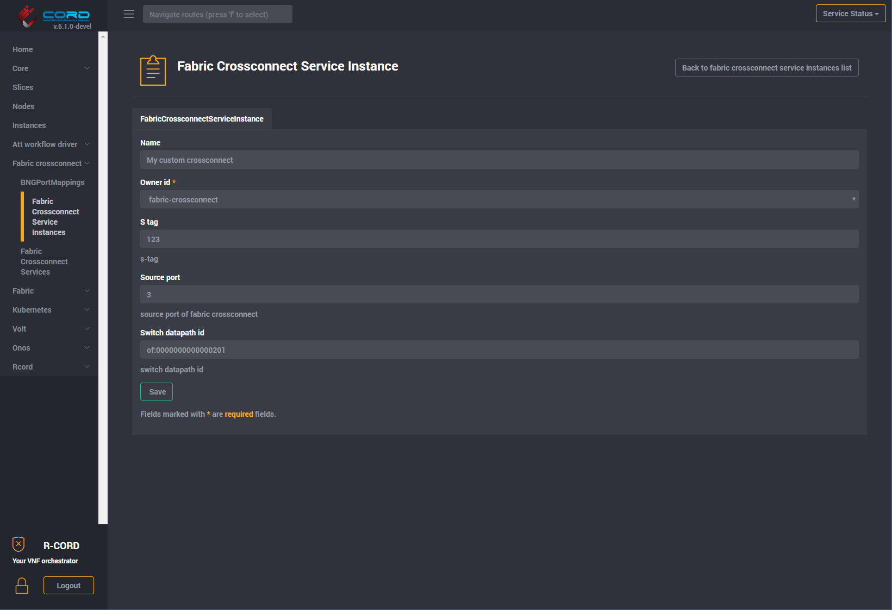
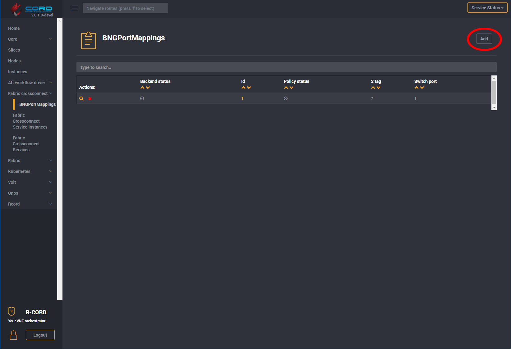
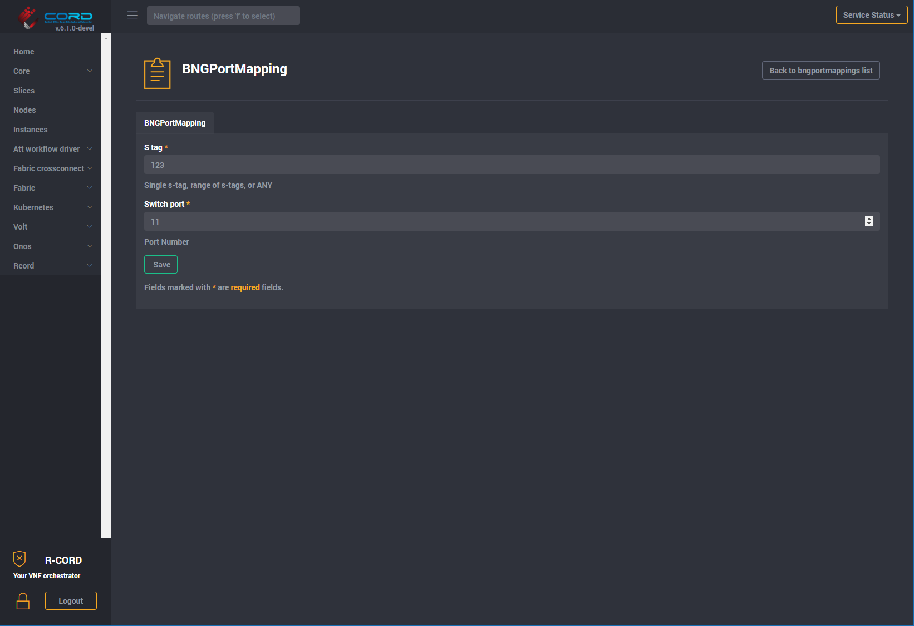

# AGG Switch Operations

The aggregation switch is managed by the [Fabric Crossconnect](/fabric-crossconnect/README.md) Service.

## Creating special-purpose VLAN crossconnects

Sometimes it is necessary to create a special purpose VLAN crossconnect, such as to connect a specific VM to a BNG. To do this, it is necessary to manually create a `FabricCrossconnectServiceInstance`. First, assure that you have the necessary information:

- `s_tag`. The VLAN tag that you wish to crossconnect.
- `source_port`. Port number on the switch for one end of the crossconnect (typically where your VM is attached).
- `destination_port`. Port number on the switch for the other end of the crossconnect (typically where your BNG is attached).
- `switch_datapath_id`. Openflow ID of the switch where the crossconnect should be created.

Next, navigate using the GUI to `Fabric crossconnect -> Fabric Crossconnect Service Instances`. There may or may not be existing service instances in the table at this time. Regardless, press the `Add` button to add a new service instance for your crossconnect:

You will be presented with an empty detail screen for a new `Fabric Crossconnect Service Instance`. Enter the `s_tag`, `source_port`, and `switch_datapath_id`, then press the `SAVE` button.

If you already have a BNGPortMapping that matches the s-tag, then you do not need to proceed any further. If not, then it will be necessary to create a new BNGPortMapping for your s-tag. Start by going to `Fabric crossconnect -> BNGPortMappings`. There may or may not be any existing port mappings in the table. Press the `Add` button to create a new BNGPortMapping.

You will be presented with an empty detail screen for a new `BNG Port Mapping`. Enter the `s_tag` and `switch port` (destination port), and then press the `SAVE` button.

