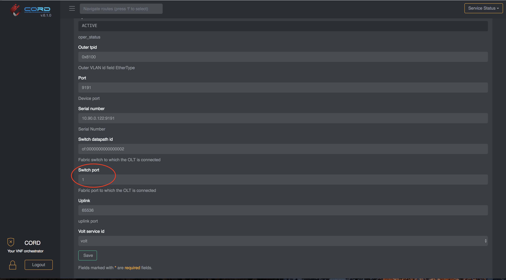
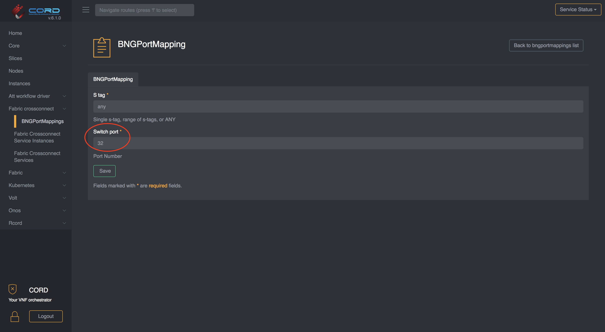
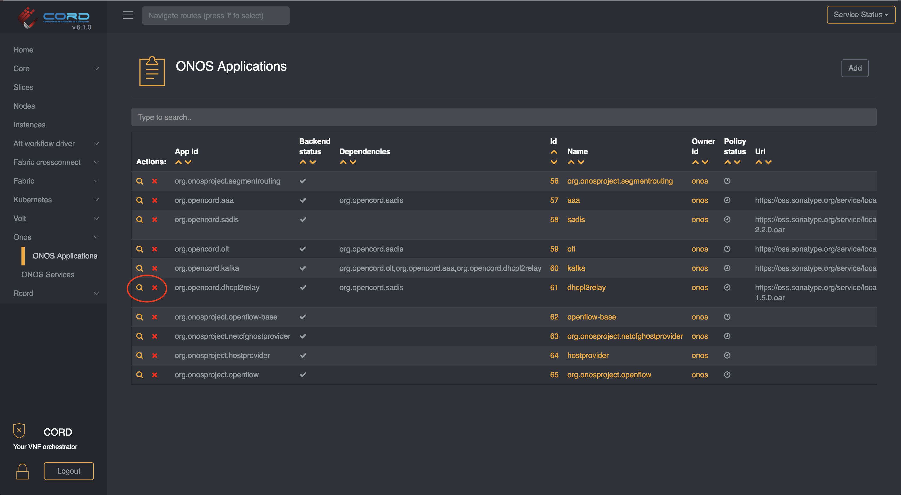
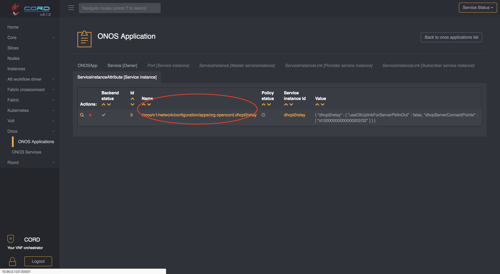

# Runtime configuration

There are cases in which you may need to change the POD configuration at runtime.

This page describes how to address some of the most common configuration changes.
Note that these updates can be done either via TOSCA, GUI or REST API.
For a reference to the TOSCA format you can look at the
[POD configuration](../configuration.md) guide, for the REST API documentation you
can refer to the [REST API](../../../operating_cord/rest_apis.html) documentation.

## I need to change the OLT Port on the Aggregation switch

If you need to connect the OLT to a different port on the aggregation switch,
you'll need to update the OLT Device model.

Navigate to `vOLT -> OLT Device` and select the OLT you want to update by clicking
on the magnifier icon. Once you are in the detailed view, locate the `switch port`
field and update it accordingly:

## I need to change the BNG facing port on the Aggregation switch

If you need to change the BNG connection to the Aggregation switch you'll need to
change the `dhcpl2relay` app configuration in ONOS as well as the crossconnect
configuration.

You can refer to the next paragraph to update the `dhcpl2relay` app config,
while to change the Crossconnect connect configuration you can navigate to
`Fabric Crossconnect -> BNG Port Mappings` and adjust the `switch port` field
as shown in figure:

## I need to change an ONOS App configuration

If you need to change the configuration of an ONOS Application, for example the
location of the DHCP Server you can follow these steps:

Navigate to `ONOS -> ONOS Application` and select the application you need to
configure by clicking on the magnifier icon:

Once you are in the detailed view, select the `ServiceInstanceAttribute` tab at the top

You'll find a list of configuration associated with that particular ONOS Application,
to modify one of those, click on the `name` and that will bring you to the detailed
view:

You can edit the JSON configuration an click `Save`. The configuration will
be pushed to ONOS.

> NOTE: Remember that the configuration must be valid JSON