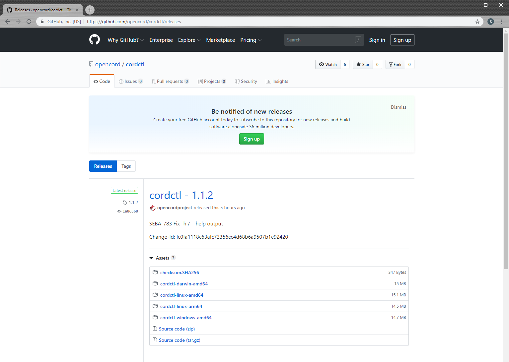

# Command-line management of a SEBA Pod

SEBA includes a tool named `cordctl` that may be used for command-line management of the pod.

## Installation and Configuration

This tool is installed on the operator's computer as a single binary. Binaries are available for multiple platforms, including Linux (AMD and ARM), Darwin, and Windows. Start by finding the binary appropriate to your computer by visiting the [cordctl release page](https://github.com/opencord/cordctl/releases).




One way to download the binary is by clicking the appropriate link in your web browser and saving the file. Another method is to copy the link and use `curl` in a shell session to download the binary. We will assume for the sake of this tutorial that you're using a Linux AMD64 workstation.

```bash
sudo curl -sSL https://github.com/opencord/cordctl/releases/download/1.1.2/cordctl-linux-amd64 -o /usr/local/bin/cordctl
sudo chmod a+x /usr/local/bin/cordctl
```

You can verify the binary is installed correctly by using the `version` command:

```bash
$ cordctl version --client-only
Client:
 Version         1.1.2
 Go version:     go1.12
 Git commit:     1a86568
 Git dirty:      false
 Built:          2019-07-09T15:12:28Z
 OS/Arch:        linux/amd64
```

Note that we used the `--client-only` flag because we have not yet configured `cordctl` with the address of our SEBA pod. We'll do that next. You'll need to know the IP address or hostname of your SEBA pod and the username and password used to access XOS on that pod. For the sake of this tutorial, we'll assume a hostname of `mysebapod`, a username of `admin@opencord.org` and a password of `letmein`.

```bash
$ cordctl -u admin@opencord.org -p letmein -s mysebapod:30011 version
Client:
 Version         1.1.2
 Go version:     go1.12
 Git commit:     1a86568
 Git dirty:      false
 Built:          2019-07-09T15:12:28Z
 OS/Arch:        linux/amd64

Server:
 Version         3.3.1
 Python version: 2.7.16
 Django version: 1.11.22.final.0
 Git commit:     bb1725739c7949a4ed0a86b18cdb6d707779244f
 Built:          2019-07-09T15:
```

As we can see, `cordctl` has retrieved information about the server. This confirms that it is successfully talking to a SEBA pod. Rather than having to specify the username, password, and server for every `cordctl` command, we can create a config file that has this information in it:

```bash
mkdir -p ~/.cord
cordctl -u admin@opencord.org -p letmein -s mysebapod:30011 config > ~/.cord/config
```

Once this is done, we no longer need to specify those arguments:

```bash
$ cordctl version
Client:
 Version         1.1.2
 Go version:     go1.12
 Git commit:     1a86568
 Git dirty:      false
 Built:          2019-07-09T15:12:28Z
 OS/Arch:        linux/amd64

Server:
 Version         3.3.1
 Python version: 2.7.16
 Django version: 1.11.22.final.0
 Git commit:     bb1725739c7949a4ed0a86b18cdb6d707779244f
 Built:          2019-07-09T15:
```

## Listing the service directory

A useful cordctl command is to see the set of services that are installed. For example,

```bash
$ cordctl service list
NAME                   VERSION    STATE
fabric                 2.2.2      present
onos                   2.1.2      present
kubernetes             1.3.1      present
volt                   2.2.4      present
att-workflow-driver    1.2.3      present
fabric-crossconnect    1.2.2      present
rcord                  1.3.2      present
core                   3.3.1      present
```

We can see that a typical stack of XOS SEBA services are present, including the att-workflow-driver service, the volt service, and the rcord service. The services are all present, and the versions are listed.

## Interacting with models

`cordctl` has several commands for interacting with models. Let's see how we might accomplish a common SEBA workflow such as disabling an ONU using `cordctl`. First lets see what ONUs are known to the pod:

```bash
$ cordctl model list ONUDevice
ID    ADMIN_STATE    DEVICE_TYPE    PON_PORT_ID    SERIAL_NUMBER    VENDOR
1     ENABLED        ponsim_onu     1              PSMO00000000     ponsim
```

This particular pod is a Seba-in-a-Box pod and it has one ONU available, and that ONU has a serial number of `PSMO00000000`. Now let's disable that ONU:

```bash
$ cordctl model update ONUDevice --filter serial_number=PSMO00000000 --set-field admin_state=ADMIN_DISABLED
ID    MESSAGE
1     Updated
```

If we look at the ONU again, we can see it has been administratively disabled:

```bash
$ cordctl model list ONUDevice
ID    ADMIN_STATE       DEVICE_TYPE    PON_PORT_ID    SERIAL_NUMBER    VENDOR
1     ADMIN_DISABLED    ponsim_onu     1              PSMO00000000     ponsim
```

You can also create new objects using `cordctl`. For example, let's add a serial number to the white list. First we have to take a short side trip to get the service identifier of the AttWorkflowDriverService:

```bash
$ cordctl model list Service --filter name=att-workflow-driver
ID    DESCRIPTION    KIND    NAME                   SERVICE_SPECIFIC_ID    VERSIONNUMBER
1                    oss     att-workflow-driver
```

The ID is `1`, we'll need to specify that ID as the `owner_id` when creating our white list entry. We're now ready to create the white list entry:

```bash
$ cordctl model create AttWorkflowDriverWhiteListEntry --set-field pon_port_id=3,serial_number=1234,device_id=5678,owner_id=1
ID    MESSAGE
2     Created
```

Note that we invented a pon_port_id, serial_number, and device_id. In a real SEBA pod, use the actual values relevant to the ONU that you're intending to add to the white list.

Deleting the white list entry is straightforward:

```bash
$ cordctl model delete AttWorkflowDriverWhiteListEntry --filter serial_number=1234
ID    MESSAGE
2     Deleted
```

## Backup and Restore

It's possible to backup and restore the XOS data model using `cordctl`. To backup, do the following:

```bash
$ cordctl backup create mybackup
Waiting for sync oooooooooooooooooooooooooooooooooooo........................................................................................................................................................................................................................................................................................................................
Status: created
URI file:///var/run/xos/backup/local/autogenerated-file-2019-07-09-21-03-41
Downloading mybackup
STATUS     CHECKSUM                                                                   CHUNKS    BYTES
SUCCESS    sha256:e33122596821a138080f522c75ee72dbb5179310a53352fc10cdf9443dc38d91    6         375656
```

This will backup the data model and place that backup in a local file called `mybackup`. If you want to restore the backup at a later time, then use the following example:

```bash
$ cordctl backup restore mybackup
Created backup file 4
Created backup-restore operation id=4 uuid=b3d4db88-04ae-444e-be19-2d1f6d4ede56
Waiting for completion ooooooooooooooooooo........................................................................................................................................................................................................................................................................................................................................................x
STATUS     CHECKSUM                                                                   CHUNKS    BYTES
SUCCESS    sha256:e33122596821a138080f522c75ee72dbb5179310a53352fc10cdf9443dc38d91    6         375656
```

## Getting more information

This short tutorial only demonstrates part of `cordctl`'s functionality. For more information, see the [cordctl documentation](../../../cordctl).
