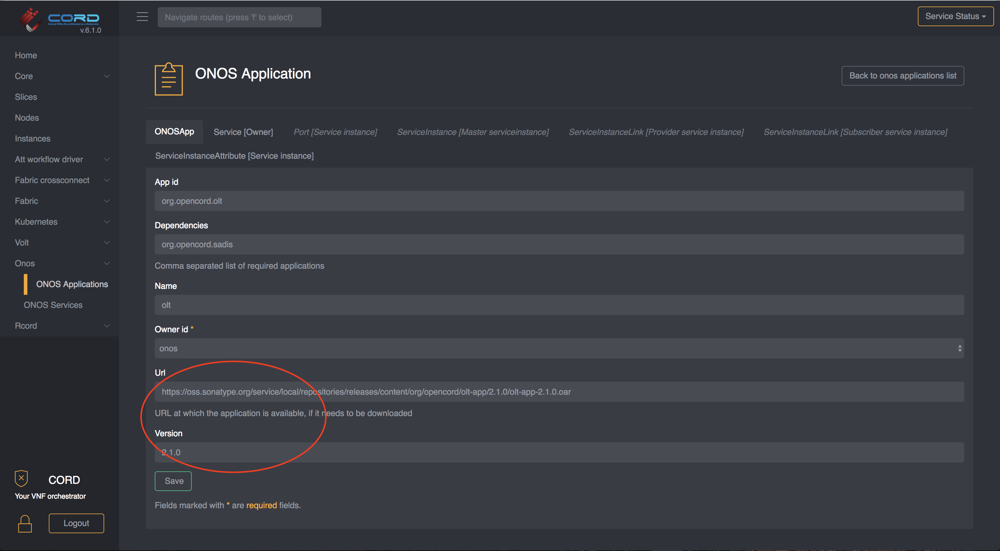

# Container Operations

CORD uses Helm to manage the lifecycles of its component micro-services.
This page describes how to perform some basic tasks using Helm commands.
It assumes that charts are being installed from CORD's online Helm chart
repository.  To add this repository to your local Helm installation:

```bash
helm repo add cord https://charts.opencord.org
helm repo update
```

If you have checked out the `helm-charts` repository locally and are installing
charts from that, replace `cord/` in the examples below with the path to the
chart.

## Upgrade a Chart

Upgrading a Helm chart will upgrade its services to the versions specified
in the chart.  For example, to upgrade the `seba-services` Helm chart to
v1.0.3, assuming that has been published to the online chart repository:

```bash
helm upgrade --version=1.0.3 --reuse-values \
    seba-services cord/seba-services
```

The `--reuse-values` flag instructs Helm to pass in the same values
used when installing the original chart.  If you want to specify a different
set of values, you can omit this and instead specify new values using
`-f myvalues.yaml`.

## Upgrade a Single XOS Service's Image

In order to upgrade a running micro-service to a new version, it's necessary to
update the Helm chart used to launch the service to specify the new Docker
image repository and/or tag.  One way to do this is by upgrading the
chart that was initially used to launch the service as mentioned above.
However some  charts (like `seba-services`) install multiple sub-charts,
each of which installs its own XOS service.  How can an operator upgrade a
single service?

An easy way to do this is with Helm's `--set` argument.  To do this it's
necessary to understand how the sub-chart specifies its image name and tag,
as well as how the charts are nested.  Using `seba-services` as an example,
suppose that we have installed `seba-services` v1.0.2, and we want to upgrade
the `fabric-crossconnect` service it installs from v1.1.4 to v1.1.5 without
upgrading the `seba-services` chart to a new version.  We can do so with this
command:

```bash
helm upgrade --version=1.0.2 --reuse-values \
    --set fabric-crossconnect.image.tag=1.1.5 \
    seba-services cord/seba-services
```

The `seba-services` chart specifies the `fabric-crossconnect` chart
as a requirement.  The `fabric-crossconnect` chart's `values.yaml`
file uses `image.tag` to specify the Docker image tag. So this command
will pull down the new image and re-launch the `fabric-crossconnect`
Kubernetes pod using this image.

As another example, v1.0.2 of the `att-workflow` chart runs
the `xosproject/att-workflow-driver:1.0.12` Docker image from Docker Hub.  Suppose that you want to install image `myrepo/att-workflow-driver:test-image` in its place.  To upgrade to this new image run:

```bash
helm upgrade --version=1.0.2 --reuse-values \
    --set att-workflow-driver.image.repository=myrepo/att-workflow-driver \
    --set att-workflow-driver.image.tag=test-image \
    att-workflow cord/att-workflow
```

To verify that you're specifying the `--set` arguments correctly, you can
replace `helm upgrade` with `helm template` in the above commands.  This will
print out all the Kubernetes resources that Helm generates, and you can
check that the image has actually been updated in the resources.

## Deploying ONOS Apps

If your applications are available on a webserver you can configure
the `seba` chart to use those applications or change them at runtime via TOSCA/GUI.

#### Configure ONOS apps at installation time

If you are going to install a POD with custom ONOS applications you can create a
custom values file as the following:

```yaml
# myvalues.yaml
seba-services:
  aaaAppUrl: "https://<my-webserver>/aaa/1.8.0/aaa-1.8.0.oar"
  sadisAppUrl: "https://<my-webserver>/sadis-app/2.2.0/sadis-app-2.2.0.oar"
  dhcpl2relayAppUrl: "https://<my-webserver>/dhcpl2relay/1.5.0/dhcpl2relay-1.5.0.oar"
  oltAppUrl: "https://<my-webserver>/olt-app/2.1.0/olt-app-2.1.0.oar"
  kafkaAppUrl: "https://<my-webserver>/kafka/1.0.0/kafka-1.0.0.oar"
```

and then install the `seba` chart using:

```bash
helm install -n seba cord/seba -f myvalues.yaml
```

For more informations on how to create a webserver containing the ONOS Apps
and deploy it on the POD you can look at the [Offline Install](../../../offline-install.md#install-a-local-web-server-using-helm-optional)

#### Change ONOS apps at runtime

If you already have a POD installed but you want to replace an application,
you have two options:

**Update ONOS apps using TOSCA**

To update an ONOS app on a running system you can use a TOSCA similar to
the following one:

```yaml
tosca_definitions_version: tosca_simple_yaml_1_0

imports:
   - custom_types/onosapp.yaml
   - custom_types/onosservice.yaml

description: Replace an ONOS applications

topology_template:
  node_templates:

    service#onos:
      type: tosca.nodes.ONOSService
      properties:
          name: onos
          must-exist: true

    onos_app#olt:
      type: tosca.nodes.ONOSApp
      properties:
        name: olt
        app_id: org.opencord.olt
        url: https://<my-webserver>/olt-app/2.1.0/olt-app-2.1.0.oar
        version: 2.1.0
        dependencies: org.opencord.sadis
      requirements:
        - owner:
            node: service#onos
            relationship: tosca.relationships.BelongsToOne
```

For instructions on how to push TOSCA into a CORD POD, please
refer to this [guide](../../../xos-tosca/README.md).

**Update ONOS apps via the GUI**

If you want to update the version of an ONOS application via the GUI,
you can simply navigate to `ONOS -> ONOS Applications` then select the application
you want to update by clicking on the magnifier icon.

Once you are in the detailed view of that application, you can just change the
`url` field and save it. Note that if the `version` has changed you'll need to
update that to.



