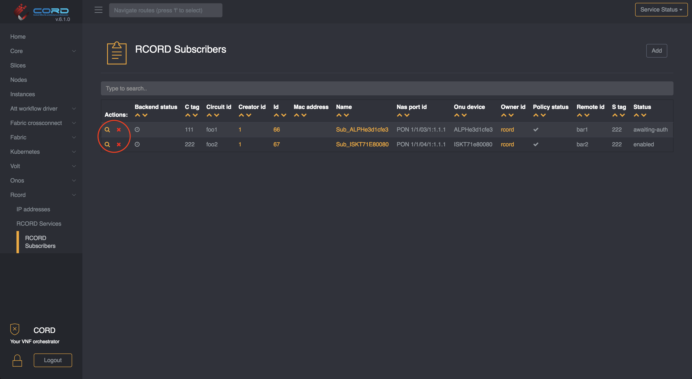
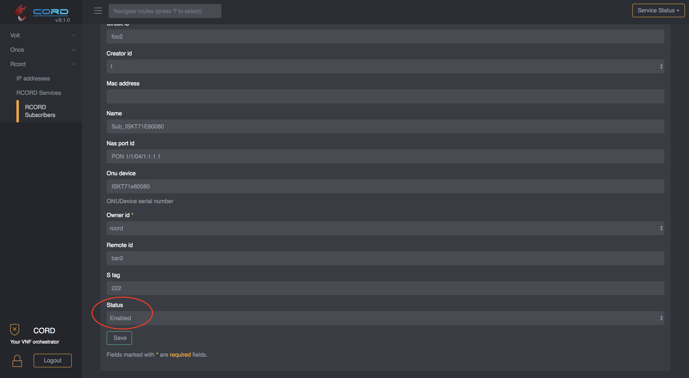

# OLT Operations

For information on how to add an OLT, please refere to the
[POD specific configuration](../configuration.md#olt-provisioning) page.

## Remove on OLT

In order to remove the OLT it is mandatory that no active subscribers are using it.

You have two options:

- [removing the subscribers](./olt-ops.md#remove-subscriber)
- [changing their state to pre-provisioned](./olt-ops.md#change-subscriber-status)

once the subscribers are gone you can navigate to `vOLT -> OLT Devices` and remove
the device by clicking on the red `X` icon on the left side of the table.

### Remove subscriber

To remove a subscriber just visit `RCORD -> RCORD Subscribers` and click on the
red `X` icon on the left side of the table.

### Change subscriber status

To change the Subscriber status, go to `RCORD -> RCORD Subscribers` and enter the
detail view by clicking on the magnifier icon. Then change its state to `Pre Provisioned`

