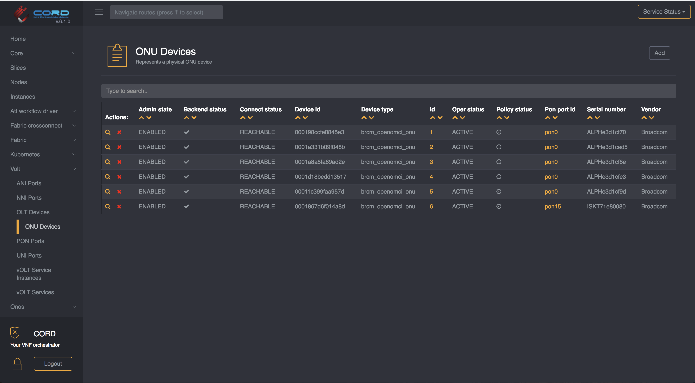
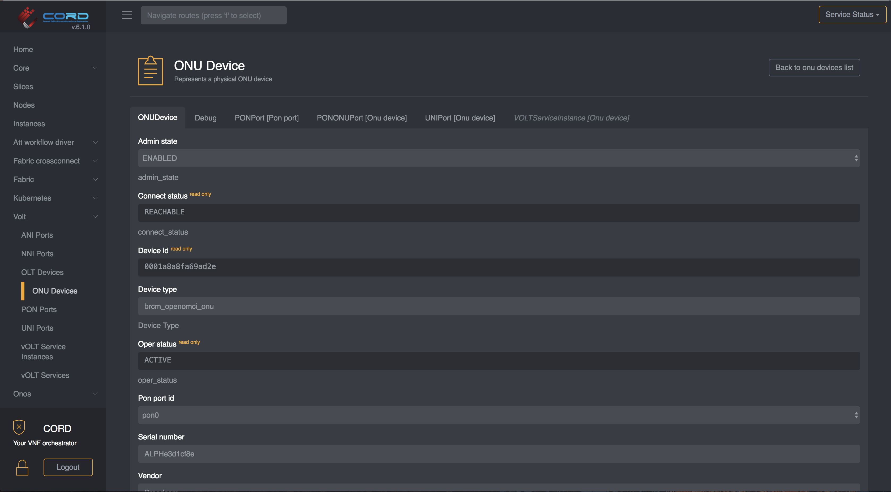

# ONU Operations

ONUs can be managed from the corresponding view in XOS,
it is located under `vOLT -> ONU Devices`

From this view you can view all the ONUs known to the system, remove them or go
to the details page (clicking on the magnifier icon)

## Enable/Disable an ONU

Once you are in the ONU details view, you can just change it's `Admin State`
to `ENABLED` if you wish the device to be enabled, or `ADMIN_DISABLED` if
you wish the device to be administratively disabled. Avoid manunally setting
the state to `DISABLED` as the workflow may toggle it back to `ENABLED`.

