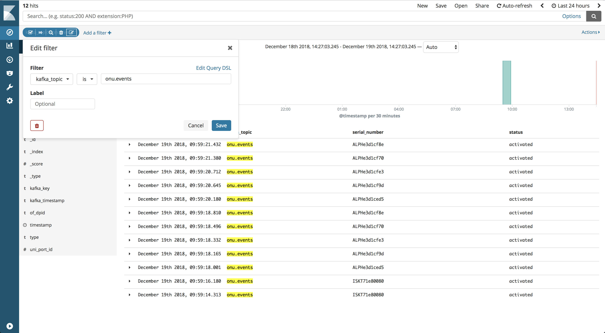

# I don't see any AttWorkflowServiceInstances

If you have added an OLT in the system but you see no AttWorkflowServiceInstances
you can debug it following these steps.

## Check the status in VOLTHA

Connect to the [VOLTHA CLI](../../../charts/voltha.md#accessing-the-voltha-cli)
and check the devices:

```shell
(voltha) devices
Devices:
+------------------+-------------------+------+------------------+------------------+-------------+-------------+----------------+----------------+------------------+------------------------+-------------------------+--------------------------+----------------------+------------------------------+
|               id |              type | root |        parent_id |    serial_number | admin_state | oper_status | connect_status | parent_port_no |    host_and_port |                 reason | proxy_address.device_id | proxy_address.channel_id | proxy_address.onu_id | proxy_address.onu_session_id |
+------------------+-------------------+------+------------------+------------------+-------------+-------------+----------------+----------------+------------------+------------------------+-------------------------+--------------------------+----------------------+------------------------------+
| 00012d28315ddb79 |           openolt | True | 000100000a5a007a | 10.90.0.122:9191 |     ENABLED |      ACTIVE |      REACHABLE |                | 10.90.0.122:9191 |                        |                         |                          |                      |                              |
| 0001d18bedd13517 | brcm_openomci_onu | True | 00012d28315ddb79 |     ALPHe3d1cfe3 |     ENABLED |      ACTIVE |      REACHABLE |      536870912 |                  | initial-mib-downloaded |        00012d28315ddb79 |                          |                    1 |                            1 |
| 00011c399faa957d | brcm_openomci_onu | True | 00012d28315ddb79 |     ALPHe3d1cf9d |     ENABLED |  DISCOVERED |      REACHABLE |      536870912 |                  |          starting-omci |        00012d28315ddb79 |                          |                    2 |                            2 |
+------------------+-------------------+------+------------------+------------------+-------------+-------------+----------------+----------------+------------------+------------------------+-------------------------+--------------------------+----------------------+------------------------------+
```

AttWorkflowServiceInstances are created once the ONUs reach are in `oper_status=ACTIVE`,
so at this given time we should expect to see only one AttWorkflowServiceInstances.

Now check the logical device representing that OLT and verify that it shows active
UNI ports:

```shell
(voltha) logical_devices
Logical devices:
+------------------+------------------+------------------+------------------+---------------------------+--------------------------+
|               id |      datapath_id |   root_device_id |  desc.serial_num | switch_features.n_buffers | switch_features.n_tables |
+------------------+------------------+------------------+------------------+---------------------------+--------------------------+
| 000100000a5a007a | 000000000a5a007a | 00012d28315ddb79 | 10.90.0.122:9191 |                       256 |                        2 |
+------------------+------------------+------------------+------------------+---------------------------+--------------------------+
(voltha) logical_device 000100000a5a007a
(logical device 000100000a5a007a) ports
Logical device ports:
+-----------+------------------+----------------+-----------+------------------+------------------------------+---------------+----------------+---------------+---------------------+------------------------+
|        id |        device_id | device_port_no | root_port | ofp_port.port_no |             ofp_port.hw_addr | ofp_port.name | ofp_port.state | ofp_port.curr | ofp_port.curr_speed | ofp_port_stats.port_no |
+-----------+------------------+----------------+-----------+------------------+------------------------------+---------------+----------------+---------------+---------------------+------------------------+
| nni-65536 | 00012d28315ddb79 |          65536 |      True |            65536 |     [0L, 0L, 0L, 1L, 0L, 0L] |     nni-65536 |              4 |          4128 |                  32 |                  65536 |
|    uni-32 | 00011c399faa957d |             32 |           |               32 |    [8L, 0L, 0L, 0L, 0L, 32L] |  ALPHe3d1cf9d |              4 |          4160 |                  64 |                        |
|    uni-16 | 0001d18bedd13517 |             16 |           |               16 |    [8L, 0L, 0L, 0L, 0L, 16L] |  ALPHe3d1cfe3 |              4 |          4160 |                  64 |                        |
+-----------+------------------+----------------+-----------+------------------+------------------------------+---------------+----------------+---------------+---------------------+------------------------+
```

If no ports are shown an error has occurred in VOLTHA, if everything
looks correct you can proceed to the next step.

## Check the status in ONOS

Connect to the [ONOS CLI](../../../charts/onos.md#accessing-the-onos-cli)
and check devices:

```shell

onos> devices
id=of:0000000000000002, available=true, local-status=connected 5h33m ago, role=MASTER, type=SWITCH, mfr=Accton Corp., hw=x86-64-accton-as6712-32x-r0, sw=ofdpa 3.0.5.5+accton1.7-1, serial=671232X1538038, chassis=2, driver=ofdpa3, channelId=10.90.0.120:46211, locType=none, managementAddress=10.90.0.120, name=AGG_SWITCH, protocol=OF_13
id=of:000000000a5a007a, available=true, local-status=connected 4h19m ago, role=MASTER, type=SWITCH, mfr=VOLTHA Project, hw=, sw=, serial=10.90.0.122:9191, chassis=a5a007a, driver=voltha, channelId=10.233.102.179:59154, locType=none, managementAddress=10.233.102.179, name=SHAD OLT, protocol=OF_13
```

You should see the aggregation switch and the logical device representing the PON.
If you can't see the logical device (`mfr=VOLTHA Project`) then an error occurred
in the communication between the VOLTHA ofagent component and ONOS.

Check if ONOS can see the active ports on the logical device:
```shell
onos> ports -e of:000000000a5a007a
id=of:000000000a5a007a, available=true, local-status=connected 4h21m ago, role=MASTER, type=SWITCH, mfr=VOLTHA Project, hw=, sw=, serial=10.90.0.122:9191, chassis=a5a007a, driver=voltha, channelId=10.233.102.179:59154, locType=none, managementAddress=10.233.102.179, name=SHAD OLT, protocol=OF_13
  port=16, state=enabled, type=fiber, speed=0 , adminState=enabled, portMac=08:00:00:00:00:10, portName=ALPHe3d1cfe3
  port=32, state=enabled, type=fiber, speed=0 , adminState=enabled, portMac=08:00:00:00:00:20, portName=ALPHe3d1cf9d
  port=65536, state=enabled, type=fiber, speed=0 , adminState=enabled, portMac=00:00:00:01:00:00, portName=nni-65536
```

If you don't see the ports there's again some issue in the communication between
the VOLTHA ofagent component and ONOS.

If everything looks correct you can move to the next step.

## Check events in Kafka

### Use Kibana

If you have installed the [Logging component](../../../charts/logging-monitoring.md#logging-dashboard) of the platform you can then look in
Kibana for these events.

Connect to the dashboard an search for events in the `onu.events` topic:



### Check in Kafka

You can install kafkacat on the POD using this command:

```shell
helm install -n kfc cord/kafkacat
```

Then you'll need to access the container and list the messages on the `onu.events`
topic:

```shell
kubectl exec -it kafkacat-7f45f65485-2lgp8 bash
root@kafkacat-7f45f65485-2lgp8:/# kafkacat -b cord-platform-kafka -t onu.events
```

If evetyhing is correct you should see:

```shell
{"timestamp":"2018-12-19T22:34:00.755Z","status":"activated","serial_number":"ALPHe3d1cfe3","uni_port_id":16,"of_dpid":"of:000000000a5a007a"}
```

If you can see events in Kafka you can proceed with the next step.

## Check the AttWorkflowDriver container

This is the last step of the process, if you have events in kafka, you should
check the logs of the `att-workflow-driver` container.

You can do that using this command:
```
kubectl logs -f att-workflow-att-workflow-driver-7c8bc95894-xgxts
```
