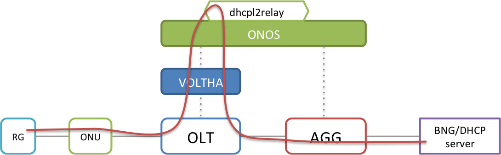
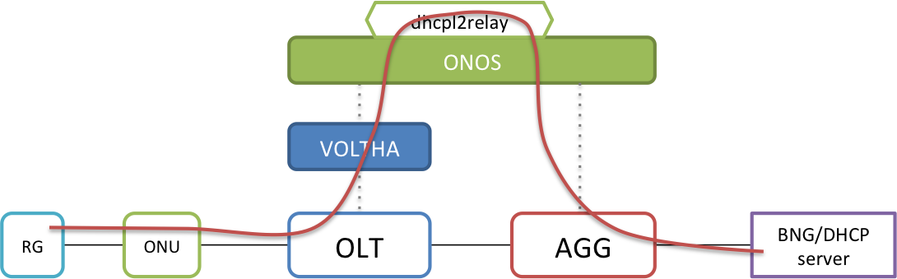
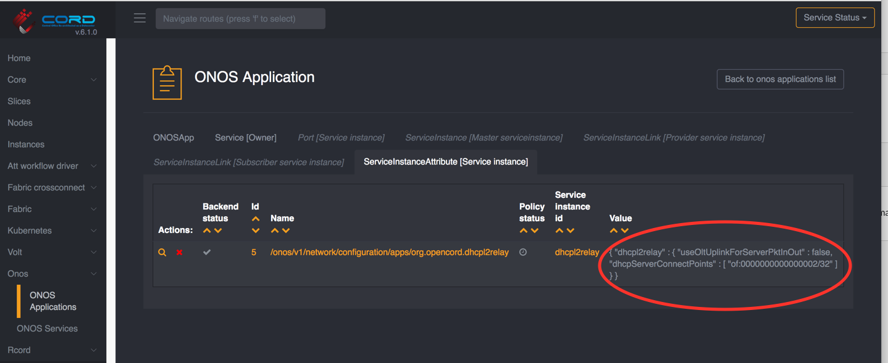
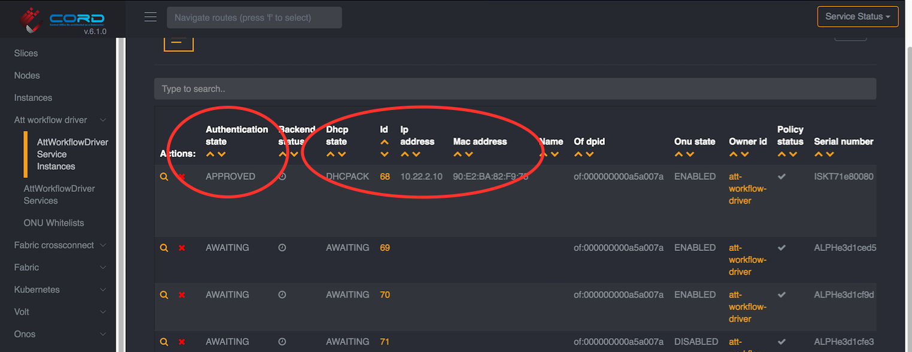

# RG is not getting IP from DHCP

To debug a failing DHCP process, it is necessary to understand the packet flow
through the system, the relevant flows in the hardware, and the expected logs.

## DHCP Relay Process

It is important to understand that DHCP will not succeed in the AT&T workflow, if
the RG has not been authenticated. Once an RG successfully authenticates, flows
that trap DHCP packets to VOLTHA and ONOS, as well as the subscribers's VLAN tags
are programmed in the OLT as well as the AGG switch.

Next it is important to understand that there are two ways the ONOS DHCP L2 Relay app
can operate. DHCP packets received from the RG can be relayed to the server using
the OLT's uplink port (that connects to the AGG switch), as shown below.



Or they can be relayed directly to the AGG switch's uplink port (that connects
to the BNG/DHCP-server). By default, a SEBA pod uses the latter mechanism.



The configuration for the DHCP relay app can be seen in the XOS GUI



As shown, the SEBA pod's default configuration for dhcpl2relay sets the
`useOltUplinkForServerPktInOut` flag to false, and provides the location of the
server attachment on port 32 of the AGG switch (`of:0000000000000002/32`).
Note: if you wish to try the OLT uplink for DHCP, set the flag to true, and remove
the `dhcpServerConnectPoint` field.

Finally, it is also useful to understand that DHCP packets are sent to the DHCP
server QinQ tagged with the subscribers S and C VLAN tags (both 0x8100 ethertype).
So if the server is not configured to accept double tagged packets, you won't get
a DHCP reply.

## DHCP server status

Please do check that a DHCP server is running on the upstream interface and is dealing out IPs.

If you followed [the lab setup guide](../lab-setup.md) you can use:
```bash
systemctl status isc-dhcp-server
```
The output should look something like:
```bash
isc-dhcp-server.service - ISC DHCP IPv4 server
   Loaded: loaded (/lib/systemd/system/isc-dhcp-server.service; enabled; vendor preset: enabled)
   Active: active (running) since Thu 2020-02-06 06:29:09 EST; 23h ago
     Docs: man:dhcpd(8)
 Main PID: 28526 (dhcpd)
    Tasks: 1
   Memory: 9.2M
      CPU: 270ms
   CGroup: /system.slice/isc-dhcp-server.service
           └─28526 dhcpd -user dhcpd -group dhcpd -f -4 -pf /run/dhcp-server/dhcpd.pid -cf /etc/dhcp/dhcpd.conf ens3f0
```
Please notice the `active (running)`.

## Relevant Flows

The DHCP packet-in/out from the OLT and the AGG switch depends on a few key flows.

### OLT DHCP flows

Connect to the [VOLTHA CLI](../../../charts/voltha.md#accessing-the-voltha-cli)
and check the logical device flows

```shell
(voltha) logical_device 000100000a5a007a
(logical device 000100000a5a007a) flows
Logical Device 000100000a5a007a (type: n/a)
Flows (12):
+----------+----------+-----------+---------+----------+----------+----------+---------+---------+--------------+--------------+----------+-----------+------------+------------+
| table_id | priority |    cookie | in_port | vlan_vid | eth_type | ip_proto | udp_src | udp_dst |     metadata | set_vlan_vid | pop_vlan | push_vlan |     output | goto-table |
+----------+----------+-----------+---------+----------+----------+----------+---------+---------+--------------+--------------+----------+-----------+------------+------------+
-snip-         |
|        0 |    10000 | ~1ec4282a |   65536 |          |      800 |       17 |      67 |      68 |              |              |          |           | CONTROLLER |            |
-snip-
|        0 |    10000 | ~68a65ba0 |   30736 |          |      800 |       17 |      68 |      67 |              |              |          |           | CONTROLLER |            |
```

Note that the second flow above is necessary because it traps DHCP packets from the
client (RG) - input port `30736` which is the UNI portnumber and `udp_src` port 68.
The first flow above is not really required as it is meant to trap DHCP packets from
the server on the OLT NNI port (in_port=65536). This is because in the SEBA POD,
these packets from the server will never reach the OLT NNI port as they will be trapped
earlier at the AGG switch uplink port.

### AGG Switch DHCP flows

There is only 1 flow that is essential for DHCP relay in the AGG switch.

Connect to the [ONOS CLI](../../../charts/onos.md#accessing-the-onos-cli)
and check the flows in the agg switch

```shell
onos> flows -s any of:0000000000000002 60
deviceId=of:0000000000000002, flowRuleCount=12
    ADDED, bytes=0, packets=0, table=60, priority=61000, selector=[IN_PORT:32, ETH_TYPE:ipv4, IP_PROTO:17, UDP_SRC:67, UDP_DST:68], treatment=[immediate=[OUTPUT:CONTROLLER], clearDeferred]
-snip-
```

Ensure that you are using the correct AGG switch dpid, for example `of:0000000000000002`,
and you are asking for the flows from Table 60 (the ACL table). As shown above,
this flow matches on DHCP packets with UDP src port 67, and incoming port 32 on the
AGG switch, which is where the DHCP server (BNG) is connected.

## DHCP relay logs

If all the flows look correct, you may wish to check ONOS logs for the DHCP transactions.
First it will be useful to set the logging to TRACE for the dhcpl2relay app.
From the ONOS CLI, use the following commands

```shell
onos> log:set TRACE org.opencord.dhcpl2relay
onos> log:list
Logger                   | Level
--------------------------------
ROOT                     | INFO
org.opencord.aaa         | DEBUG
org.opencord.dhcpl2relay | TRACE
```

Next, check the logs by grepping for the app logs

```shell
onos> log:tail | grep DhcpL2Relay

2018-12-20 22:42:06,464 | INFO  | 33.102.179:59154 | DhcpL2Relay                      | 186 - org.opencord.dhcpl2relay - 1.5.0 | Received DHCP Packet of type DHCPDISCOVER from of:000000000a5a007a/30736
2018-12-20 22:42:06,474 | TRACE | 33.102.179:59154 | DhcpL2Relay                      | 186 - org.opencord.dhcpl2relay - 1.5.0 | DHCP packet received from client at of:000000000a5a007a/30736
2018-12-20 22:42:07,597 | DEBUG | 33.102.179:59154 | DhcpL2Relay                      | 186 - org.opencord.dhcpl2relay - 1.5.0 | option82data [id:ISKT71e80080,cTag:222,sTag:222,nasPortId:PON 1/1/04/1:1.1.1,uplinkPort:-1,slot:-1,hardwareIdentifier:null,ipaddress:null,nasId:null,circuitId:foo2,remoteId:bar2]
2018-12-20 22:42:07,600 | INFO  | 33.102.179:59154 | DhcpL2Relay                      | 186 - org.opencord.dhcpl2relay - 1.5.0 | Finished processing packet.. relaying to dhcpServer
2018-12-20 22:42:07,603 | TRACE | 33.102.179:59154 | DhcpL2Relay                      | 186 - org.opencord.dhcpl2relay - 1.5.0 | Relaying packet to dhcp server at of:0000000000000002/32
2018-12-20 22:42:08,000 | INFO  | 0.90.0.120:46211 | DhcpL2Relay                      | 186 - org.opencord.dhcpl2relay - 1.5.0 | Received DHCP Packet of type DHCPOFFER from of:0000000000000002/32
2018-12-20 22:42:08,002 | TRACE | 0.90.0.120:46211 | DhcpL2Relay                      | 186 - org.opencord.dhcpl2relay - 1.5.0 | DHCP packet received from server at of:0000000000000002/32
2018-12-20 22:42:08,026 | INFO  | 0.90.0.120:46211 | DhcpL2Relay                      | 186 - org.opencord.dhcpl2relay - 1.5.0 | Finished processing packet.. relaying to client
2018-12-20 22:42:08,028 | INFO  | 0.90.0.120:46211 | DhcpL2Relay                      | 186 - org.opencord.dhcpl2relay - 1.5.0 | Sending DHCP packet to client at of:000000000a5a007a/30736
2018-12-20 22:42:08,029 | TRACE | 0.90.0.120:46211 | DhcpL2Relay                      | 186 - org.opencord.dhcpl2relay - 1.5.0 | Relaying packet to dhcp client at of:000000000a5a007a/30736
2018-12-20 22:42:08,088 | INFO  | 33.102.179:59154 | DhcpL2Relay                      | 186 - org.opencord.dhcpl2relay - 1.5.0 | Received DHCP Packet of type DHCPREQUEST from of:000000000a5a007a/30736
2018-12-20 22:42:08,088 | TRACE | 33.102.179:59154 | DhcpL2Relay                      | 186 - org.opencord.dhcpl2relay - 1.5.0 | DHCP packet received from client at of:000000000a5a007a/30736
2018-12-20 22:42:08,092 | DEBUG | 33.102.179:59154 | DhcpL2Relay                      | 186 - org.opencord.dhcpl2relay - 1.5.0 | option82data [id:ISKT71e80080,cTag:222,sTag:222,nasPortId:PON 1/1/04/1:1.1.1,uplinkPort:-1,slot:-1,hardwareIdentifier:null,ipaddress:null,nasId:null,circuitId:foo2,remoteId:bar2]
2018-12-20 22:42:08,093 | INFO  | 33.102.179:59154 | DhcpL2Relay                      | 186 - org.opencord.dhcpl2relay - 1.5.0 | Finished processing packet.. relaying to dhcpServer
2018-12-20 22:42:08,095 | TRACE | 33.102.179:59154 | DhcpL2Relay                      | 186 - org.opencord.dhcpl2relay - 1.5.0 | Relaying packet to dhcp server at of:0000000000000002/32
2018-12-20 22:42:08,148 | INFO  | 0.90.0.120:46211 | DhcpL2Relay                      | 186 - org.opencord.dhcpl2relay - 1.5.0 | Received DHCP Packet of type DHCPACK from of:0000000000000002/32
2018-12-20 22:42:08,148 | TRACE | 0.90.0.120:46211 | DhcpL2Relay                      | 186 - org.opencord.dhcpl2relay - 1.5.0 | DHCP packet received from server at of:0000000000000002/32
2018-12-20 22:42:08,153 | INFO  | 0.90.0.120:46211 | DhcpL2Relay                      | 186 - org.opencord.dhcpl2relay - 1.5.0 | Finished processing packet.. relaying to client
2018-12-20 22:42:08,158 | INFO  | 0.90.0.120:46211 | DhcpL2Relay                      | 186 - org.opencord.dhcpl2relay - 1.5.0 | Sending DHCP packet to client at of:000000000a5a007a/30736
2018-12-20 22:42:08,159 | TRACE | 0.90.0.120:46211 | DhcpL2Relay                      | 186 - org.opencord.dhcpl2relay - 1.5.0 | Relaying packet to dhcp client at of:000000000a5a007a/30736
```

Notice the app receives DHCPDISCOVER and DHCPREQUEST packets from the client RG at
`of:000000000a5a007a/30736` and relays them to the server at `of:0000000000000002/32`.

Similarly, the app receives DHCPOFFER and DHCPACK packets from `of:0000000000000002/32`
and relays them to the client at `of:000000000a5a007a/30736`.

Also note that the option-82 data is added to the packet before relaying to the
server. This data, related to the subscriber is top down provisioned by the [operator
in the AT&T workflow](../configuration.md). Without this configuration, DHCP will
not work.

If you wish to see the packets, check the logs (in TRACE) without
the grep in the previous command. For example,

```shell
onos> log:tail
-snip-
2018-12-20 22:42:08,148 | INFO  | 0.90.0.120:46211 | DhcpL2Relay                      | 186 - org.opencord.dhcpl2relay - 1.5.0 | Received DHCP Packet of type DHCPACK from of:0000000000000002/32
2018-12-20 22:42:08,148 | TRACE | 0.90.0.120:46211 | DhcpL2Relay                      | 186 - org.opencord.dhcpl2relay - 1.5.0 | DHCP packet received from server at of:0000000000000002/32
ip
dl_qinqVlan: 222
dl_qinqVlan_pcp: 0
dl_vlan: 222
dl_vlan_pcp: 0
dl_src: 00900b237d11
dl_dst: 90e2ba82f975
nw_src: 10.22.2.254
nw_dst: 10.22.2.10
nw_tos: 16
nw_proto: 17
tp_src: 67
tp_dst: 68
-snip-
```

shows the DHCP ACK packet received from the server with outer S-tag 222 (`dl_qinqVlan`)
and the inner C-tag 222 (`dl_vlan`). Note that packets received from the client
will only have the C-tag.

You can also check the DHCP allocation on the ONOS CLI

```shell
onos> dhcpl2relay-allocations
SubscriberId=PON 1/1/04/1:1.1.1,ConnectPoint=of:000000000a5a007a/30736,State=DHCPACK,MAC=90:E2:BA:82:F9:75,CircuitId=None,IP Allocated=10.22.2.10,Allocation Timestamp=2018-12-20T22:42:08.153Z
```

and in the XOS GUI, the relevant AAA authentication and DHCP status.


